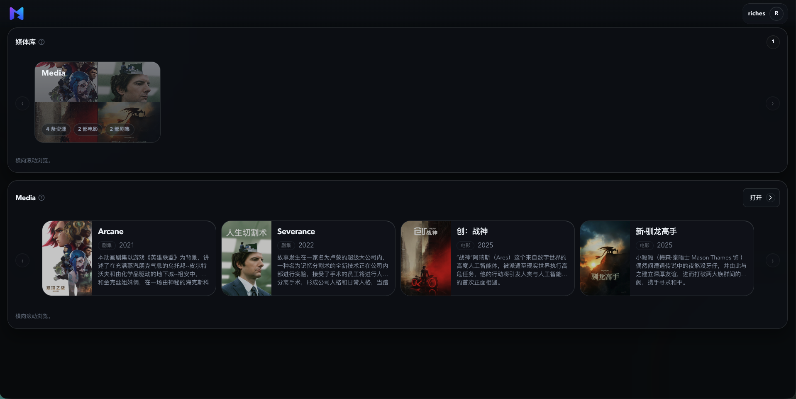
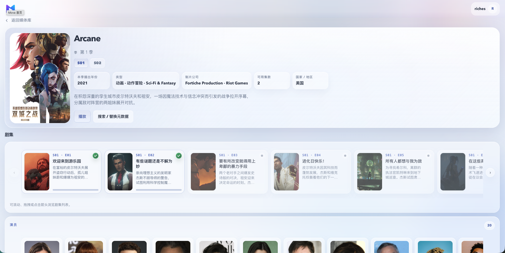
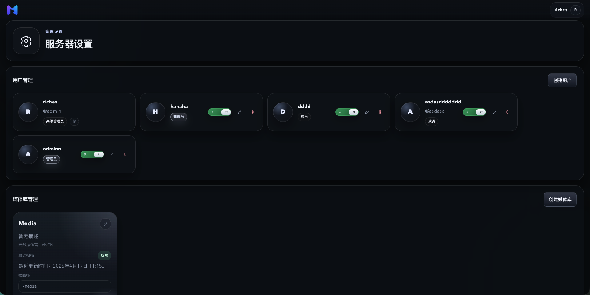

<p align="center">
  
</p>

<h1 align="center">Mova</h1>

<p align="center">
  A self-hosted media server for local movies and series, built around automatic organization, rich metadata, and a polished watching flow.
</p>



## What Mova Is

Mova 是一个自托管媒体服务器，用来整理、浏览和播放本地电影与剧集。它的重点不是做复杂后台，而是把“挂载目录、自动扫描、补齐元数据、继续观看、管理用户权限”串成一条轻量、好看的使用链路。

当前版本定位为可用 MVP，适合在本地或家用服务器上管理自己的媒体库。

## Product Highlights

- 自动识别电影和剧集：创建媒体库后会自动首扫，后续通过 `Scan Library` 显式同步新增、删除、改名和移动。
- 本地结构优先可用：即使没有 TMDB token，也会按目录和文件名兜底展示，不会因为缺元数据变成空库。
- 更像产品的 Web 体验：首页、媒体库、详情页和播放器都围绕日常使用设计，而不是普通管理面板。
- 元数据按需补全：详情页需要演员、海报、背景、IMDb 评分或片头信息时再补齐并持久化，避免扫描阶段浪费资源。
- 面向客户端扩展：Web 使用 session 登录，原生客户端可通过 token 登录接口接入同一套媒体服务。

## Core Features

- 媒体库自动首扫和手动重扫
- 电影、剧集自动聚合与本地兜底展示
- 电影多版本文件选择
- 剧集季/集列表、下一集、继续观看
- 播放进度保存和接近片尾自动完成
- 字幕切换、音轨切换、资源文件技术信息展示
- 片头跳过 `Skip Intro`，在资源缺少片头数据时按需分析
- 深色 / 浅色主题与中英文界面切换，本地浏览器保存偏好
- `Primary Admin`、普通管理员、成员三级用户能力
- 成员级媒体库访问权限控制

## Screenshots

### Detail Page And Light Theme



### Server Settings



## Deployment

### Requirements

- Docker
- Docker Compose
- 一个宿主机上的媒体目录

### Configure

```bash
cp .env.example .env
```

常用配置：

```env
MOVA_MEDIA_ROOT=/absolute/path/to/media
MOVA_TMDB_ACCESS_TOKEN=
MOVA_OMDB_API_KEY=
HTTP_PROXY=
HTTPS_PROXY=
```

- `MOVA_MEDIA_ROOT` 必填，会只读挂载到容器内固定目录 `/media`
- `MOVA_TMDB_ACCESS_TOKEN` 可选，不填也能扫描、入库和播放
- `MOVA_OMDB_API_KEY` 可选，配置后会在拿到 `imdb_id` 时补 IMDb 评分

### Start

```bash
docker compose up -d --build
```

默认地址：

- Web: `http://127.0.0.1:36080`
- Health: `http://127.0.0.1:36080/api/health`

### First Run

1. 首次启动会进入 bootstrap 页面
2. 创建第一个管理员，它会成为 `Primary Admin`
3. 进入服务器设置创建媒体库
4. 选择容器内 `/media` 下的目录
5. 保存后自动开始第一次扫描

### Data

运行数据主要写入：

- `data/postgres/`
- `data/cache/`

媒体目录只读挂载，Mova 不会修改你的原始媒体文件。

如果当前开发阶段接受重建本地数据，可以清理数据库目录后重启：

```bash
rm -rf data/postgres
docker compose up -d --build
```

## Documentation

- API: [docs/API.md](docs/API.md)
- Frontend: [apps/mova-web/README.md](apps/mova-web/README.md)
- Backend: [apps/mova-server/README.md](apps/mova-server/README.md)
- Crates: [crates/README.md](crates/README.md)

## Roadmap And Feedback

Mova 仍在积极迭代中，作者正在维护 Pad 和 macOS 客户端方向，让它可以更自然地接入同一个自托管媒体服务器。

如果你在使用中有体验问题、功能建议或客户端接入需求，欢迎提交 issue 或改进意见。

## License

Current license: `MIT`. See [LICENSE](LICENSE).
