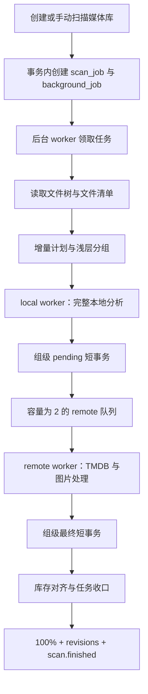

# 媒体库扫描与刮削设计说明

本文档定义 Mova 媒体库扫描、文件分析、电影与剧集归组、TMDB 匹配、图片缓存、数据库写入、任务进度和 SSE 通知的服务端方案。

HTTP 接口见 [`API.md`](API.md)，SSE 事件见 [`SSE.md`](SSE.md)，TMDB 字段和 endpoint 见 [`TMDB.md`](TMDB.md)。

## 1. 设计原则

- HTTP 请求只负责创建扫描任务，不持有扫描生命周期。
- 扫描任务和后台任务保存在 PostgreSQL。
- 一个媒体库最多存在一个 `pending` 或 `running` 扫描任务。
- 文件系统、`ffprobe`、TMDB 和图片下载不得放在数据库事务中。
- 本地分析负责确定可播放结构和唯一远端查询类型。
- 完整季集坐标使用 TMDB TV；其他文件使用 TMDB movie。
- 自动匹配采用严格名称和年份规则，不计算相似度分数，不跨类型兜底。
- 同一扫描组的本地写入和远端写入分别使用短事务。
- local worker 与 remote worker 通过有界队列形成流水线。
- 服务端持久化任务级权威进度，客户端不得自行估算。
- SSE 只提供临时扫描展示和资源失效通知，最终业务数据通过 HTTP API 读取。
- 扫描重试必须幂等，不得生成重复媒体项、季、集或物理文件。

## 2. 总体流程



local 与 remote 不是独立进程或容器，而是 `mova-server` 内同一个扫描任务的两个 Tokio 异步执行角色。

```text
Local:  A 本地分析 -> B 本地分析 -> C 本地分析
                    |              |
Remote:             A TMDB        B TMDB        C TMDB
```

扫描组完成 pending 事务后即可进入 remote 队列，同时 local worker 继续分析下一个组。队列满时 local worker 等待，形成自然背压。

## 3. 后台任务与并发

服务启动时根据 `MOVA_WORKER_CONCURRENCY` 创建后台 worker 池：

```text
MOVA_WORKER_CONCURRENCY=2
```

默认最多同时执行两个后台扫描任务。同一媒体库由进程内扫描注册表和数据库活跃任务约束共同保证单执行者。

每个扫描任务包含：

- 一个 local worker。
- 一个 remote worker。
- 一个容量为 2 的 `tokio::mpsc` 队列。
- 一个扫描取消标记。
- 一个后台任务 lease 心跳。

资源上限：

- 单个扫描任务只串行执行一个本地扫描组。
- 单个扫描任务只串行执行一个远端扫描组。
- 每个文件的 `ffprobe` 串行执行。
- 单个任务最多保留当前 local 组、当前 remote 组和两个排队组的完整分析上下文。
- 多媒体库总并发由 `MOVA_WORKER_CONCURRENCY` 控制。

低功耗 NAS 或机械硬盘环境可以设置 `MOVA_WORKER_CONCURRENCY=1`。

## 4. 持久化状态

### 4.1 `scan_jobs`

每个扫描任务保存：

```text
id
library_id
status
phase
total_files
scanned_files
reused_files
local_analyzed_files
local_committed_files
remote_completed_files
progress_percent
created_at
started_at
finished_at
error_message
```

任务状态：

```text
pending
running
success
failed
```

任务 phase：

```text
discovering
processing
finalizing
finished
```

`pending` 任务的 phase 为 `null`。等待后台重试时任务也使用 `pending / null`，并保留上一次执行的权威进度和错误上下文。`reused_files` 在增量计划完成时保存本轮无需重新处理的文件数，扫描失败时也不会把尚未处理的文件误算为复用。

### 4.2 `scan_job_groups`

扫描组检查点保存：

```text
id
scan_job_id
group_key
file_count
local_analyzed
local_committed
remote_completed
created_at
updated_at
```

约束：

```text
unique(scan_job_id, group_key)
```

三个布尔检查点用于幂等推进父任务的文件计数。同一组重复提交不会重复增加进度。后台重试重新执行文件发现和分组，并重建这些检查点。

### 4.3 扫描通知摘要

Remote worker 为当前执行尝试维护一个内存摘要：

```text
matched_files
unmatched_files
failed_files
skipped_files
probe_warning_count
issue_count
issues[最多 20 条]
```

每个 remote 扫描组只有在最终媒体事务成功提交后才更新摘要，避免把已回滚的组计算为成功结果。计数以组内物理文件数累计；`issue_count` 以问题组计数，可以大于内嵌的 `issues` 数量。单个问题摘要包含：

```text
item_key
media_type
title
year
file_count
metadata_status
metadata_failure_reason
failure_detail
probe_warning_count
probe_warning_file_path
probe_warning_detail
```

`failure_detail` 和 probe warning detail 会压缩空白并限制长度。`ffprobe` 失败不改变 metadata 状态，也不阻断远端匹配。摘要不建立独立数据库表；成功任务在 finalize 事务中直接把它写入 `notifications.payload`。执行尝试异常退出时，后台任务按原 scan job 重试并重新计算摘要；重试耗尽时通知保存任务级 `error_message`，原始诊断保留在 `tracing` 日志。

### 4.4 `background_jobs`

扫描请求在同一数据库事务中创建 scan job 和 `library.scan` background job。后台任务保存：

```text
job_type
related_scan_job_id
payload
status
attempt_count
max_attempts
run_after
locked_by
lease_expires_at
last_error
```

worker 使用 `FOR UPDATE SKIP LOCKED` 领取任务，并定期续租。lease 失效的运行任务可以被其他 worker 重新领取。

## 5. 文件发现

发现阶段递归读取媒体库根目录，生成轻量文件清单：

```text
file_path
file_size
modified_at
```

发现阶段不执行 sidecar 解析、`ffprobe`、TMDB 或图片下载。

文件发现数量按以下条件节流写入扫描任务：

- 首次可见数量。
- 与上次持久化数量相差至少 25。
- 距离上次写入至少 500ms。
- 发现任务结束时强制写入最终数量。

完整文件树、增量计划和浅层分组建立后，任务进入 `processing`，进度基线为 10%。

## 6. 增量扫描

每个物理文件使用以下信息判断是否需要处理：

- 文件路径、大小和修改时间。
- `scan_hash`。
- `local_analysis_version`。
- metadata 状态。
- TMDB provider binding。
- 图片是否已经缓存为可访问的本地资源。

### 6.1 完全复用

满足以下条件的文件跳过拆名、sidecar、`ffprobe`、TMDB、图片缓存和数据库 upsert：

- `scan_hash` 一致。
- `local_analysis_version` 一致。
- metadata 状态可接受。
- provider binding 完整。
- 不需要按 metadata language 重新获取远端数据。
- 不包含需要转存的远端图片 URL。

此类文件在生成计划时直接计入 analyzed、committed 和 remote completed。

### 6.2 复用本地分析，仅刷新远端

以下文件复用数据库中的本地分析结果，并进入 remote 流水线：

- metadata 状态为 `pending`、`unmatched` 或 `failed`。
- provider 启用后需要处理 `skipped` 条目。
- 缺少 TMDB provider binding。
- metadata language 发生变化。
- 卡片缺少可用远端类型或需要复核。
- 图片字段保存远端 URL。

本地缓存恢复固定使用批量查询：

1. 一次查询媒体摘要。
2. 一次查询全部相关音轨。
3. 一次查询全部相关字幕。

禁止按每个文件分别查询音轨和字幕。

### 6.3 完整本地分析

以下文件执行完整本地分析：

- 新增文件。
- 文件大小或修改时间变化。
- `local_analysis_version` 变化。
- 无法恢复可信本地分析结果。

完整本地分析后，只有 `matched` 且已绑定 provider ID 的条目可以保留已确认的远端展示字段。`pending`、`unmatched`、`failed` 或 `skipped` 条目不得用旧数据库标题覆盖新版本拆名结果。

## 7. 浅层名称分析

浅层分析只读取文件名和目录路径，用于在执行 `ffprobe` 之前建立稳定扫描组。

### 7.1 清理规则

名称清理至少识别：

- 文件扩展名。
- 分辨率：`2160p`、`1080p`、`720p`。
- 视频格式：`WEB-DL`、`WEBRip`、`BluRay`、`REMUX`。
- 编码：`H.264`、`H.265`、`HEVC`、`AV1`。
- HDR：`HDR10`、`Dolby Vision`。
- 音频：`Atmos`、`DTS-HD`、`TrueHD`。
- 发布组和校验标签。

这些标签属于资源版本信息，不参与作品标题匹配。

### 7.2 季集坐标

文件名必须同时包含 season 和 episode 才建立剧集身份。主要形式：

```text
S01E02
s1e2
1x02
Season 1 Episode 2
第1季第2集
```

缺少完整季集坐标的文件按电影处理。目录名、自然排序、`EP02`、`第03集` 或纯数字文件名不能单独建立剧集身份。

明确季集标记之前的文本用于剧名；季集标记之后、年份或发布规格之前的文本可以作为单集标题。

## 8. 扫描组

### 8.1 电影组

电影文件以本地解析标题、年份和路径建立扫描身份。远端匹配后，具有相同 TMDB `provider_item_id` 的文件归并为同一个 movie media item，并作为多个 media file 资源版本展示。

同一作品的 1080p、2160p、HDR 和不同音轨版本共享电影业务元数据，但保留各自文件路径、技术信息、音轨和字幕。

### 8.2 剧集组

剧集组代表整部电视剧：

- 同一部电视剧的多个季归入一个 series group。
- 组内按 `season_number` 创建季。
- 季内按 `episode_number` 创建集。
- 整部剧只选择一个 TMDB series ID。
- TMDB series metadata 在组内复用。
- 只为本地存在的季和集创建可播放结构。

series group key 在存在明确季目录树时使用规范化容器路径，否则使用文件名解析出的规范化剧名。容器路径只是不透明分组边界，不从目录文字提取标题、别名或年份。

### 8.3 分组约束

- group key 在同一个 scan job 内唯一且稳定。
- `tvshow.nfo` 的系列标题和年份优先于文件名。
- S01 文件中的年份是系列首播年；S02 及以后文件中的年份是季播出年，两者不能混用。
- 组内存在 S01 时不采用后续季年份。缺少 S01 和系列年份时，最早已导入季的季号与年份可作为远端季验证提示。
- 年份不是剧集跨季拆组条件。
- 同一物理文件只能属于一个扫描组。
- 同一季集坐标可以关联多个物理版本，但只能指向一个 episode 业务条目。

## 9. Local worker

Local worker 按扫描组串行执行：

1. 解析 NFO 和 sidecar。
2. 解析本地海报、背景图和字幕。
3. 对需要分析的文件执行 `ffprobe`。
4. 提取容器、时长、分辨率、编码、HDR、帧率、码率、音轨和内嵌字幕。
5. 合并外挂字幕。
6. 构建本地电影或剧集结构。
7. 持久化 analyzed 检查点。
8. 执行 pending 组事务。
9. 将扫描组发送到 remote 队列。

单个组内的文件按稳定路径顺序处理。`ffprobe` 通过 blocking worker 执行，不阻塞 Tokio reactor。

## 10. Sidecar、图片与字幕

### 10.1 NFO

本地文件元数据读取与视频同名的 `<stem>.nfo`，找不到时再读取同目录的 `movie.nfo`；可提取标题、原始标题、排序标题、年份、简介和图片引用。

剧集身份从视频所在目录向上查找最近的 `tvshow.nfo`，最多检查五层祖先目录。该文件中的非空标题和年份优先于文件名分析结果；单集 `<stem>.nfo` 的 `<title>` 不会被误用为系列标题。目录名称只用于定位 NFO 和建立分组边界，不作为 NFO 缺失时的标题或年份回退值。

### 10.2 图片层级

- 电影海报只写电影海报字段。
- 剧集海报只写 series 海报字段。
- 季海报只写 season 海报字段。
- 单集剧照只写 episode 海报字段。
- 海报不得作为背景图兜底。
- 单集剧照不得提升为剧集海报或背景。

pending 事务不得清空已有远端图片。只有严格匹配成功的最终事务可以根据远端详情清理确认缺失的字段。

### 10.3 字幕

支持 `srt`、`ass`、`ssa` 和 `vtt`。外挂字幕优先按去除语言和属性后缀的文件 stem 精确匹配，其次按同一季集坐标匹配。无法唯一归属时不自动关联。

字幕属性包括 language、default、forced、hearing impaired、SDH、CC、external 和 embedded。

## 11. Pending 组事务

Local worker 完成分析后执行一个短事务：

1. 按文件路径读取现有 media file。
2. upsert 顶层电影或剧集结构。
3. upsert 季和单集。
4. upsert 组内全部 media file。
5. 替换发生变化的音轨和字幕。
6. 将需要远端补全的 metadata 标记为 `pending`。
7. 保留 provider binding 和已有 artwork。
8. 只执行一次孤儿结构清理。
9. 幂等写入 `local_committed` 检查点。
10. 增加一次 `library:{id}:catalog` revision。
11. 提交事务。

事务内设置：

```sql
set_config('mova.defer_catalog_revision', 'on', true)
```

逐行 catalog trigger 在该事务中不增加 revision，由组事务末尾显式增加一次。事务失败时整组回滚。

## 12. Remote worker

Remote worker 从有界队列领取已经完成 pending 事务的扫描组：

1. 根据本地结构确定唯一 TMDB media type。
2. 读取可信 provider binding。
3. 没有 binding 时执行一次严格搜索。
4. 选中 provider ID 后按 ID 获取详情。
5. 获取需要的季和集 metadata。
6. 从同一 TMDB 详情响应读取 `vote_average / vote_count`，不增加评分请求。
7. 下载并缓存海报、背景图、季海报和单集剧照。
8. 生成 metadata 终态。
9. 执行最终组事务。

演员不在扫描阶段为全部媒体预抓。媒体详情接口按需获取演员并持久化。

## 13. TMDB 严格匹配

### 13.1 唯一查询类型

```text
完整 season_number + episode_number -> TV
其他文件                              -> movie
```

指定类型没有严格命中时，结果为未匹配，不查询另一类型。

### 13.2 名称与年份

- 名称与 localized title、original title 或 alternative title 的标准化主标题完全相等。别名中的 `$` 只有位于两个 ASCII 英文字母之间时才按风格化字母 `s` 处理；例如 `Cashero` 与 `Ca$hero` 可以严格对齐，`$100` 不会匹配 `S100`，普通标题也不会全局忽略空白。数字结尾的续集名允许远端在同一主标题后用 `:`、`：`、`|`、`｜`、`–`、`—` 追加副标题，不做普通前缀匹配。
- 同名同年候选有多个时，优先保留 `original_title / original_name` 也与本地主标题严格对齐的子集；子集仍不唯一时保持未匹配，不根据 UI 语言硬编码猜测制作国家。
- 名称标准化只消除大小写、空白、常见标点和全角半角差异；`·`、`・`、`•` 等装饰性间隔号视为纯排版差异。
- 不使用前缀、包含、编辑距离、popularity 或评分模型。
- 电影发行年与 TMDB `release_date`、剧集首播年与 TMDB `first_air_date` 必须完全相同，且不执行无年份重试。
- 只有后续季播出年时，TV search 使用 `year` 参数，随后读取候选对应 `season_number` 的 season details；季或其集的播出年份必须相同，验证后的候选必须唯一。
- 没有作品年份或季播出年时，从严格主标题候选中选择完整日期最新者；最新日期并列时保持未匹配。
- 全部缺少日期时，结果为未匹配。

### 13.3 Provider binding

- 可信 provider ID 与本地 media type 一致时直接按 ID 获取详情。
- NFO provider ID 必须经过类型、名称和年份校验。
- 搜索选出的 ID 直接用于详情请求。
- 详情请求不得再次按标题搜索。

完整 endpoint 和字段覆盖规则见 [`TMDB.md`](TMDB.md)。

## 14. Metadata 终态

| `metadata_status` | `metadata_failure_reason` | 含义 |
| --- | --- | --- |
| `matched` | `null` | 严格匹配并完成远端写入 |
| `unmatched` | `no_remote_match` | 唯一类型中没有严格候选 |
| `failed` | `metadata_provider_error` | provider 请求或处理失败 |
| `skipped` | `metadata_provider_disabled` | metadata provider 未启用 |
| `pending` | `null` | 本地事务已经提交，等待远端处理 |

`unmatched`、`failed` 和 `skipped` 是扫描组的远端处理终态，会计入任务完成度，但不表示匹配成功。

`remote_media_type` 只在严格绑定远端条目时写入。客户端不得通过启发式规则伪造远端类型。

## 15. 最终组事务

Remote worker 完成远端处理后执行一个短事务：

1. 锁定扫描组检查点。
2. 按 provider ID 归并电影或剧集顶层条目。
3. 更新标题、原始标题、年份、简介、国家、类型、工作室和评分。
4. 更新对应层级的 artwork。
5. 更新本地存在的季与单集 metadata。
6. 写入 metadata 终态和 provider binding。
7. 只执行一次孤儿结构清理。
8. 幂等写入 `remote_completed` 检查点。
9. 增加一次 `library:{id}:catalog` revision。
10. 提交事务。

网络请求、图片下载和文件读取必须在事务开始前完成。

## 16. 任务级权威进度

发现阶段进度范围为 1～10。完成文件树、增量计划和浅层分组后，以物理文件数计算：

```text
analyzed_ratio  = local_analyzed_files  / total_files
committed_ratio = local_committed_files / total_files
remote_ratio    = remote_completed_files / total_files

progress = floor(
  10
  + 20 * analyzed_ratio
  + 20 * committed_ratio
  + 49 * remote_ratio
)
```

| 阶段 | 进度 |
| --- | ---: |
| 任务排队 | 0 |
| 文件发现 | 1～10 |
| 全部本地分析完成 | 30 |
| 全部 pending 事务完成且远端尚未完成 | 50 |
| local/remote 流水处理 | 10～99 |
| 收口阶段 | 99 |
| 成功终态 | 100 |

local 与 remote 可以同时增加各自计数，因此进度不要求停留在 30 或 50。

计数规则：

- 复用文件在计划阶段同时计入三个计数。
- 完成本地分析后按扫描组 `file_count` 增加 analyzed。
- pending 事务提交后增加 committed。
- 最终组事务提交后增加 remote completed。
- 所有计数使用 SQL 原子更新。
- 扫描组检查点保证重复提交不重复计数。
- `progress_percent` 使用 `greatest(old, calculated)` 保证单调不回退。
- 运行中最大为 99。
- 只有成功终态写入 100。
- 失败和取消保留最后权威进度。

## 17. 条目级临时进度

| stage | 展示百分比 | 持久化条件 |
| --- | ---: | --- |
| `analyzed` | 30 | 本地分析检查点完成 |
| `pending_committed` | 40 | pending 组事务提交 |
| `metadata` | 60 | 开始远端 metadata 处理 |
| `artwork` | 85 | 开始图片处理 |
| `completed` | 100 | 最终组事务提交 |

这些百分比只用于单个扫描卡片动画，不参与任务总进度计算。

## 18. Finalize

所有 local 与 remote 工作结束后执行：

1. 对齐发现路径和正式 `media_files`。
2. 删除确认缺失的物理文件记录。
3. 清理没有资源的电影、单集、季和剧集。
4. 接收 remote worker 已累计的扫描通知摘要。
5. 将 phase 写为 `finalizing`，进度写为 99。
6. 成功时将任务写为 `success / finished / 100`。
7. 在任务终态事务中把扫描摘要直接写入一条 `scan` 类通用通知。
8. 推进最终 catalog、scan 和 notifications revisions。
9. 发送 `scan.finished`。

`unmatched` 和 `skipped` 属于业务结果，不使整个扫描任务失败。

任务完成后，客户端通过 `GET /api/notifications` 读取通用通知中心。扫描通知包含任务级统计，并最多内嵌 20 个未匹配、provider 失败或包含 `ffprobe` 警告的问题摘要；`issue_count` 保留实际问题组总数。服务端不提供独立扫描报告接口，完整底层诊断由运维侧从服务日志读取。`library:{id}:scan` 与 `library:{id}:notifications` revisions 在任务终态事务中一起推进，因此客户端不依赖 SSE 回放历史错误或通知正文。

## 19. 错误与重试

应用层记录失败 phase、文件计数、最后权威进度和带阶段上下文的 `error_message`。后台任务统一决定重试或终止：

- 有剩余重试额度时，background job 和 scan job 回到 `pending`。
- 等待重试时保留任务进度和错误上下文。
- 下一次 worker 领取时清除错误并重新执行发现与计划。
- 重试使用同一个 scan job ID。
- 中间失败不发送 `scan.finished`。
- 重试额度耗尽后写入 `failed / finished` 并发送 `scan.finished`。

删除媒体库、修改需要替换任务的配置或 lease 所有权丢失时触发取消标记。worker 在组边界和关键 I/O 边界检查取消状态。

## 20. Revision 与 SSE

扫描使用：

```text
library:{id}:scan
library:{id}:catalog
library:{id}:notifications
```

- scan job 创建和状态变化增加 scan revision。
- pending 组事务增加一次 catalog revision。
- 最终组事务增加一次 catalog revision。
- 扫描终态事务生成扫描通知并增加一次 notifications revision。
- 普通任务计数不逐次增加 scan revision。
- 业务数据与 revision 在同一事务提交。
- 普通进度最多每 200ms 合并一批。
- 全部 pending 组提交后发送带 revisions 的本地检查点。
- 终态立即发送最终 revisions。

客户端规则见 [`SSE.md`](SSE.md)。

## 21. 数据库与连接池约束

- 文件 I/O、`ffprobe` 和网络请求不持有数据库连接。
- pending 和最终写入使用短事务。
- 同一扫描组的全部文件在一个事务中提交。
- 每个组事务只执行一次孤儿结构清理。
- 每个组事务只显式增加一次 catalog revision。
- 普通单条业务写入使用逐行 revision trigger。
- worker 并发不得超过数据库连接池能够支撑的事务数量。

## 22. 部署边界

- 单实例通过进程内 local/remote 队列发送临时进度。
- background job、scan job 和 revisions 保存在 PostgreSQL。
- `MOVA_TMDB_ACCESS_TOKEN` 为空或只含空白时 metadata provider 处于 disabled 状态。服务和扫描任务仍正常运行，local worker 继续完成名称解析、sidecar、`ffprobe` 和 pending 写入；remote worker 不发起 TMDB 请求，只完成本地图片缓存和 `skipped / metadata_provider_disabled` 终态提交。
- 后续配置 Token 并重启服务后，重新扫描会把此前 `skipped` 且缺少 provider binding 的条目纳入远端补全，不需要重建数据库。
- 服务重启后可以重新领取未完成 background job。
- 扫描组完整分析上下文不做跨进程恢复，重试会重新建立文件计划。
- 多实例需要为临时扫描进度提供跨实例 `ProgressBus`。
- 外部消息组件不得替代 PostgreSQL 中的任务状态、业务数据和 resource revisions。

## 23. 验收要求

### 23.1 正确性

- 同一媒体库不能并发执行两个扫描任务。
- 重复扫描不生成重复媒体项或物理文件。
- 同一剧集跨季归入一个 series。
- 无完整季集坐标的文件不自动查询 TV。
- 严格匹配失败时不跨类型兜底。
- pending 写入不清空已有 artwork。
- 组事务失败时不留下半完成组。
- 任务进度不回退。
- 中间重试失败不发送终态。
- 最终媒体写入与 `remote_completed` 检查点必须原子提交，通知摘要只在该事务成功后累计。
- provider 超时必须归类为 `metadata_provider_error`，不得伪装成严格匹配失败。
- `ffprobe` 失败必须作为非阻断警告进入扫描通知摘要。

### 23.2 性能

- 缓存恢复不产生音轨和字幕 `2N` 查询。
- `ffprobe` 不阻塞 Tokio reactor。
- local/remote 队列容量固定。
- 扫描普通 SSE 进度按 200ms 合并。
- 扫描组数据库写入只增加一次 catalog revision。
- 同一 TMDB 搜索结果不执行第二次标题搜索。

### 23.3 客户端

- 任务总进度只使用服务端 `progress_percent`。
- 条目 stage 只用于临时卡片。
- 活跃扫描期间合并普通 catalog revisions。
- 本地检查点刷新一次 pending 目录。
- `scan.finished` 刷新最终目录后再删除临时卡片。
- 断线后通过 realtime state 恢复任务状态。

## 24. Schema 与开发期数据

扫描状态字段、`scan_job_groups`、后台任务和通用通知表定义在 `migrations/0001_init.sql`。项目处于 pre-1.0 阶段，schema 变更直接修改该初始化迁移，不提供增量兼容 migration。

修改扫描 schema 后需要停止服务、清理 `data/postgres`、重新初始化数据库、创建管理员和媒体库，并重新扫描媒体文件。
