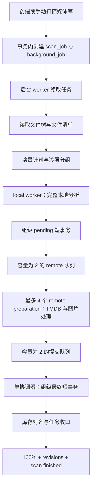

# 媒体库扫描与刮削设计说明

本文档定义 Mova 媒体库扫描、文件分析、电影与剧集归组、TMDB 匹配、图片缓存、数据库写入、任务进度和 SSE 通知的服务端方案。

HTTP 接口见 [`API.md`](API.md)，SSE 事件见 [`SSE.md`](SSE.md)，NFO 本地元数据契约见 [`NFO_METADATA.md`](NFO_METADATA.md)，TMDB 接入规则见 [`TMDB_INTEGRATION.md`](TMDB_INTEGRATION.md)，完整 v3 endpoint 目录见 [`TMDB.md`](TMDB.md)。

## 1. 设计原则

- HTTP 请求只负责创建扫描任务，不持有扫描生命周期。
- 扫描任务和后台任务保存在 PostgreSQL。
- 一个媒体库最多存在一个 `pending` 或 `running` 扫描任务。
- 文件系统、`ffprobe`、TMDB 和图片下载不得放在数据库事务中。
- 本地分析负责确定可播放结构和唯一远端查询类型。
- 完整季集坐标使用 TMDB TV；其他文件使用 TMDB movie。
- 本地有年份时采用严格名称与年份规则；无年份时先采用 TMDB 首屏精准标题命中，没有命中再回退首个结果。两者都不计算相似度分数，也不跨类型兜底。
- 同一扫描组的本地写入和远端写入分别使用短事务。
- local worker 与远端准备池通过有界队列形成流水线；权威提交由单协调器串行执行。
- 服务端持久化任务级权威进度，客户端不得自行估算。
- SSE 只提供临时扫描展示和资源失效通知，最终业务数据通过 HTTP API 读取。
- 扫描重试必须幂等，不得生成重复媒体项、季、集或物理文件。
- `.strm` 是本地远程媒体引用载体；扫描只校验其中单个 HTTP(S) URL，不访问远端、不执行 `ffprobe`，也不保存或记录 URL。

## 2. 总体流程


```mermaid
flowchart TD
    Create["创建或手动扫描媒体库"] --> Enqueue["事务内创建 scan_job 与 background_job"]
    Enqueue --> Claim["后台 worker 领取任务"]
    Claim --> Discover["读取文件树与文件清单"]
    Discover --> Plan["增量计划与浅层分组"]
    Plan --> Local["local worker：完整本地分析"]
    Local --> LocalCommit["组级 pending 短事务"]
    LocalCommit --> Queue["容量为 2 的 remote 队列"]
    Queue --> Remote["最多 4 个 remote preparation：TMDB 与图片处理"]
    Remote --> CommitQueue["容量为 2 的提交队列"]
    CommitQueue --> RemoteCommit["单协调器：组级最终短事务"]
    RemoteCommit --> Finalize["库存对齐与任务收口"]
    Finalize --> Finished["100% + revisions + scan.finished"]
```

local、remote preparation 与 commit coordinator 不是独立进程或容器，而是 `mova-server`
内同一个扫描任务的 Tokio 异步执行角色。

```text
Local:     A 本地分析 -> B 本地分析 -> C 本地分析
                       |              |
Remote(4):             A/B/C 的 TMDB 与图片可重叠
                       |              |
Commit(1):             按完成顺序串行提交权威状态
```

扫描组完成 pending 事务后即可进入 remote 队列，同时 local worker 继续分析下一个组。输入队列、
远端并发和提交队列均有硬上限；任一段饱和时上游等待，形成自然背压。

## 3. 后台任务与并发

服务启动时根据 `MOVA_WORKER_CONCURRENCY` 创建后台 worker 池：

```text
MOVA_WORKER_CONCURRENCY=2
```

默认最多同时执行两个后台扫描任务。同一媒体库由进程内扫描注册表和数据库活跃任务约束共同保证单执行者。

每次后台任务领取都会把 `attempt_count` 单调增加，并形成
`job_id + locked_by + attempt_count` 执行 fence。扫描进度、组级媒体写入、最终缺失路径对账和任务终态都必须在各自事务内锁定并校验该 fence，同时确认 lease 尚未过期。旧 worker 的 lease 失效并被重新领取后，即使随后恢复运行，也不能再提交任何扫描业务数据或覆盖新 worker 的任务状态。进程内扫描注册表只负责本实例取消与互斥，不作为跨实例一致性边界。

每次领取事务会先按创建时间锁定并终结最多 64 个遗弃任务，再领取一个可执行任务。租约过期的 `cancel_requested` 任务与父 scan job 原子进入 `cancelled`；最终尝试租约过期的 `running` 任务与父 scan job 原子进入 `failed`。终态通知和 realtime revision 在同一事务内生成，避免 worker 崩溃后留下永久 `running` 的扫描任务。

每个扫描任务包含：

- 一个 local worker。
- 最多 4 个 remote preparation future。
- 一个容量为 2 的 local→remote `tokio::mpsc` 队列。
- 一个容量为 2 的 remote→commit `tokio::mpsc` 队列。
- 一个串行 commit coordinator。
- 一个扫描取消标记。
- 一个后台任务 lease 心跳。

资源上限：

- 单个扫描任务只串行执行一个本地扫描组。
- 单个扫描任务最多并行准备 4 个远端扫描组，只串行提交一个完成组。
- 每个文件的 `ffprobe` 串行执行。
- 单个任务最多保留当前 local 组、两个输入排队组、四个远端准备组、两个提交排队组和一个
  正在提交组的完整分析上下文；每一段都受固定容量约束，不随媒体库规模增长。
- 单次执行的 TMDB 元数据查询缓存最多保留 512 项，剧集季集概览缓存最多保留 128 项，图片 URL 结果缓存最多保留 2048 项。
- 三类内存缓存均按插入顺序淘汰最早项；命中不改变淘汰顺序。图片文件保留在磁盘缓存中，内存索引淘汰后会先重新校验磁盘文件，不会因此重复下载有效图片。
- 多媒体库总并发由 `MOVA_WORKER_CONCURRENCY` 控制。
- 播放阶段的音轨切换不属于扫描流水线。服务端按需执行 stream-copy remux，并使用独立的进程级资源闸门：最多同时生成 2 个变体，生成上界为源文件大小加 256 MiB，且该上界必须不超过 128 GiB；全部媒体库的音轨缓存总量不超过 256 GiB。超过单产物上界的源文件会在启动 FFmpeg 前拒绝。
- 音轨缓存命中直接返回。未命中时先以 try-acquire 取得进程级生成名额，再最多等待同一缓存键 5 秒；名额已满或等待超时均返回可重试的 `503`，不让 HTTP 请求无限堆积。音轨和字幕 `HEAD` 都只完成鉴权、关联、路径边界和已有缓存校验，不触发生成；缓存命中时返回准确资源头，未命中时返回 `no-store` 且不声明虚假的资源长度。
- 服务端开始监听请求前会先把已有音轨缓存整理到 256 GiB 配额内，目录读取或淘汰失败会阻止启动。生成前再预留最坏情况空间，并按最早生成时间淘汰旧产物和进程崩溃遗留的临时文件；预留同时读取缓存卷实际可用空间、计入所有在途 reservation，并确保完成后至少保留 5 GiB。相同缓存 key 使用 single-flight，完成后通过同文件系统原子重命名发布，超时、取消、失败或超限均不保留残缺缓存。

低功耗 NAS 或机械硬盘环境可以设置 `MOVA_WORKER_CONCURRENCY=1`。

## 4. 持久化状态

### 4.1 `scan_jobs`

每个扫描任务保存：

```text
id
library_id
status
phase
total_files
scanned_files
reused_files
local_analyzed_files
local_committed_files
remote_completed_files
progress_percent
created_at
started_at
finished_at
error_message
```

任务状态：

```text
pending
running
success
failed
cancelled
```

任务 phase：

```text
discovering
processing
finalizing
finished
```

`pending` 任务的 phase 为 `null`。等待后台重试时任务也使用 `pending / null`，并保留上一次执行的权威进度和错误上下文。`reused_files` 在增量计划完成时保存本轮无需重新处理的文件数，扫描失败时也不会把尚未处理的文件误算为复用。

### 4.2 `scan_job_groups`

扫描组检查点的完整字段为：

```text
scan_job_id
group_key
file_count
local_analyzed
local_committed
remote_completed
```

约束：

```text
primary key(scan_job_id, group_key)
```

三个布尔检查点用于幂等推进父任务的文件计数。同一组重复提交不会重复增加进度。后台重试重新执行文件发现和分组，并重建这些检查点。

### 4.3 扫描通知摘要

Remote worker 为当前执行尝试维护一个内存摘要：

```text
matched_files
unmatched_files
failed_files
skipped_files
probe_warning_count
issue_count
issues[最多 20 条]
```

每个 remote 扫描组只有在最终媒体事务成功提交后才更新摘要，避免把已回滚的组计算为成功结果。计数以组内物理文件数累计；`issue_count` 以问题组计数，可以大于内嵌的 `issues` 数量。单个问题摘要包含：

```text
item_key
media_type
title
year
file_count
metadata_status
reason_code
reason_params
diagnostic_message
probe_warning_count
probe_warning_file_path
probe_warning_code
probe_warning_params
probe_warning_diagnostic
```

`reason_code / reason_params` 是客户端本地化的稳定输入。`diagnostic_message` 和 `probe_warning_diagnostic` 会压缩空白并限制长度，只用于排障和未知原因码兜底。`ffprobe` 失败不改变 metadata 状态，也不阻断远端匹配。摘要不建立独立数据库表；任务进入成功、失败或取消终态时，在 finalize 事务中直接把摘要写入 `notifications.payload`。执行尝试异常退出时，后台任务按原 scan job 重试并重新计算摘要；重试耗尽时通知使用任务级 `reason_code = scan_execution_failed`，底层错误放入 `diagnostic_message` 并同时保留在 `tracing` 日志。

### 4.4 `background_jobs`

扫描请求在同一数据库事务中创建 scan job 和 `library.scan` background job。后台任务的完整字段为：

```text
id
job_type
scope_type
scope_id
related_scan_job_id
payload
status
attempt_count
max_attempts
run_after
locked_by
locked_at
lease_expires_at
last_error
created_at
updated_at
finished_at
```

worker 使用 `FOR UPDATE SKIP LOCKED` 领取任务，并定期续租。续租、完成和失败重试都必须同时匹配 owner 与当前 `attempt_count`；已经过期的 lease 不允许被原 worker 复活。lease 失效的运行任务可以被其他 worker 重新领取，新 generation 成为唯一可写执行者。

## 5. 文件发现

发现阶段递归读取媒体库根目录，生成轻量文件清单：

```text
file_path
file_size
modified_at
sidecar_fingerprint
source_kind
stream_reference_hash
```

`sidecar_fingerprint` 只读取文件名、大小和修改时间，不读取 sidecar 内容。每个包含视频的目录只建立一次索引，按稳定路径顺序汇总 NFO、可作为本地海报或背景图的图片、支持的外挂字幕，以及视频目录向上五层内最近的 `tvshow.nfo`。最近 `tvshow.nfo` 位于祖先容器时，还汇总该 NFO 同目录中的标准系列图片 `poster / folder / cover`、`fanart / backdrop / background` 和 `clearlogo / logo`；这些候选只用于增量失效，实际投影仍必须通过通用 NFO 的全库归属校验。

NFO、同名图片或外挂字幕的新增、删除、大小变化和修改时间变化会让受影响目录中的视频重新进入本地分析。发现阶段不执行 sidecar 内容解析、`ffprobe`、TMDB 或图片下载。普通视频的 `source_kind` 为 `local_file`；`.strm` 的 `source_kind` 为 `strm`，引用哈希由校验后的 URL 文本计算，数据库只保存哈希而不保存 URL。

STRM 引用文件最大 8 KiB，必须是 UTF-8，可带 BOM，并且修剪首尾空白后恰好包含一个 `http://` 或 `https://` URL。URL 必须有主机，最长 4096 字节，允许查询参数，不允许 userinfo、fragment、其他协议、多行列表或注释。内容格式错误只形成当前文件的稳定扫描问题，任务最终为“完成但有问题”；目录遍历、载体读取或路径边界检查失败仍会让本轮发现失去权威性，并中止最终缺失路径删除。

遍历开始时先规范化媒体库根目录的真实路径。每个候选文件和子目录在读取前都必须规范化，并且其真实路径仍以该库的真实根目录为前缀；指向库外的文件或目录符号链接直接跳过。指向库内的符号链接可以使用，目录遍历按真实路径去重，避免符号链接环路和重复递归。

文件发现数量按以下条件节流写入扫描任务：

- 首次可见数量。
- 与上次持久化数量相差至少 25。
- 距离上次写入至少 500ms。
- 发现任务结束时强制写入最终数量。

阻塞式目录遍历只更新一个原子 latest 值，并通过容量为 1 的信号通道唤醒异步持久化任务；数据库写入变慢时中间计数可以合并，但内存不会随文件数量增长，最终计数不会丢失。

完整文件树、增量计划和浅层分组建立后，任务进入 `processing`，进度基线为 10%。

## 6. 增量扫描

每个物理文件使用以下信息判断是否需要处理：

- 文件路径、大小和修改时间。
- `scan_hash`。
- `local_analysis_version`。
- metadata 状态。
- TMDB provider binding。
- 图片是否已经缓存为可访问的本地资源。

`local_analysis_version` 由服务端实现统一维护。数据库中的版本与当前实现不一致时，文件不能复用旧的本地名称分析，必须在下一次扫描中重新执行完整本地分析；不需要删除媒体库、重置数据库或手工清理缓存。

### 6.1 完全复用

满足以下条件的文件跳过拆名、sidecar、`ffprobe`、TMDB、图片缓存和数据库 upsert：

- `scan_hash` 一致。
- `local_analysis_version` 一致。
- metadata 状态可接受。
- provider binding 完整。
- 不需要按 metadata language 重新获取远端数据。
- 不包含需要转存的远端图片 URL。

此类文件在生成计划时直接计入 analyzed、committed 和 remote completed。

为保持既有本地媒体的增量缓存稳定，本地文件沿用由文件大小、修改时间和 `sidecar_fingerprint` 组成的 `scan_hash`。STRM 在相同基础上额外加入 `source_kind` 和 `stream_reference_hash`；因此本地 sidecar 或 STRM 引用变化时都不能复用旧的本地分析。只有载体及其本地依赖均未变化时，才允许直接进入“仅刷新远端”路径。

STRM 完整本地分析继续复用文件名、目录、NFO、本地图片和外挂字幕规则，但不运行 `ffprobe`，不生成内嵌音轨/字幕，也不创建片头检测任务。它与本地文件通过相同的严格本地身份和 TMDB provider ID 归组，因此可以成为同一电影或同一集的另一个播放版本，不会复制媒体条目、播放进度或继续观看记录。

增量计划在过滤完全复用文件之前，先从本轮发现且仍然存在的全部文件路径中建立容器 binding 索引。索引只接受 `matched`、provider 为 TMDB、远端类型与本地结构一致且 provider ID 非空的既有条目；数据库中已经不在本轮文件树中的旧路径不能参与复用。同一媒体库内，相对媒体库根目录路径相同的业务容器中：

- 去重后只有一个 TMDB ID 时，该 ID 可以作为新增文件的直接查询提示。
- 出现多个不同 TMDB ID 时，容器标记为冲突，不自动选择其中任何一个。
- 标题相同但容器路径不同的文件不能通过该索引相互继承。

剧集可以复用同容器的唯一 binding。电影只在文件名没有可用作品标题、因而采用电影容器身份时复用该索引；普通合集目录中的不同电影不会因为共享父目录而继承身份。

### 6.2 复用本地分析，仅刷新远端

以下文件复用数据库中的本地分析结果，并进入 remote 流水线：

- metadata 状态为 `pending`、`unmatched` 或 `failed`。
- provider 启用后需要处理 `skipped` 条目。
- 缺少 TMDB provider binding。
- metadata language 发生变化。
- 卡片缺少可用远端类型或需要复核。
- 图片字段保存远端 URL。

本地缓存恢复固定使用批量查询：

1. 文件级媒体摘要和轻量 owner 字段按最多 2,000 个路径分批查询，避免超大路径数组；
   常规扫描仍只需一个批次。
2. 按最多 2,000 个唯一 owner ID 分批查询 NFO payload 与 TMDB retention snapshot，
   避免同一剧集的大对象随每一集重复返回。
3. 一次查询全部相关音轨。
4. 一次查询全部相关字幕。

禁止按每个文件分别查询音轨和字幕。

### 6.3 完整本地分析

以下文件执行完整本地分析：

- 新增文件。
- 文件大小或修改时间变化。
- `local_analysis_version` 变化。
- 无法恢复可信本地分析结果。

完整本地分析后，只有 `matched` 且已绑定 provider ID 的条目可以保留已确认的远端展示字段。`pending`、`unmatched`、`failed` 或 `skipped` 条目不得用旧数据库标题覆盖新版本拆名结果。

## 7. 浅层名称分析

浅层分析只读取文件名和目录路径，用于在执行 `ffprobe` 之前建立稳定扫描组。

### 7.1 清理规则

名称清理至少识别：

- 文件扩展名。
- 分辨率：`2160p`、`1080p`、`720p`。
- 视频格式：`WEB-DL`、`WEBRip`、`BluRay`、`REMUX`。
- 编码：`H.264`、`H.265`、`HEVC`、`AV1`。
- HDR：`HDR10`、`Dolby Vision`。
- 音频：`Atmos`、`DTS-HD`、`TrueHD`。
- 发布组和校验标签。
- 容器名称末尾受支持的 TMDB 身份标记。

这些标签属于资源版本信息，不参与作品标题匹配。

### 7.2 季集坐标

文件名必须同时包含 season 和 episode 才建立剧集身份。主要形式：

```text
S01E02
s1e2
1x02
Season 1 Episode 2
第1季第2集
```

缺少完整季集坐标的文件按电影处理。目录名、自然排序、`EP02`、`第03集` 或纯数字文件名不能单独建立剧集身份。

完整季集标记本身足以建立季集坐标，不要求标记前必须带有剧名。因此 `S01E01.mkv` 和 `1x02.mkv` 可以建立 episode 本地结构，但仍需要通过 `tvshow.nfo` 或受限容器回退取得系列标题。明确季集标记之前的非空文本用于剧名；季集标记之后、年份或发布规格之前的文本可以作为单集标题。

### 7.3 受限容器身份

容器标题和年份回退只解决文件名没有可用作品标题的情况，不进行无界向上猜测：

- 所有路径先相对当前媒体库真实根目录处理，候选不得采用或越过媒体库根目录。
- 剧集从视频直接父目录开始，只跳过明确识别出的季目录和纯技术版本目录，例如 `Season 01`、`S01`、`第 1 季`、`4K`、`2160p`、`WEB-DL`、`DV` 或 `HDR`。
- 剧集遇到第一个非结构目录后立即停止。该目录是合法业务名称时作为唯一容器候选；若它是纯数字、媒体类型目录、合集目录、占位目录、临时目录或其它无效名称，则本次容器回退失败，不再继续采用更高层目录。
- 电影不跳过父目录层级，只检查视频的直接父目录。直接父目录无效、属于季目录、属于纯技术目录或就是媒体库根目录时，电影容器回退失败。
- 有明确作品标题的文件仍以文件名身份为主。通过归属边界校验的 `tvshow.nfo` 非空系列标题和年份优先于文件名；文件名没有系列标题时才使用容器标题和年份。电影文件名没有可用标题时，直接父目录标题和年份成为主身份；通过归属边界校验的电影 NFO 本地展示字段仍按 sidecar 规则保留。

例如：

```text
/media/tv/千香/Season 01/4K/S01E01.mkv
          ↑ 唯一业务容器；Season 01 与 4K 只作为结构层跳过

/media/movies/星球大战曼达洛人与古古(2026)/
  2026.2160p.iT.WEB-DL.DV.DDP5.1.Atmos.2Audio.mkv
              ↑ 文件名没有作品标题，使用直接父目录标题和 2026

/media/tv/国产剧/新建文件夹/S01E01.mkv
                 ↑ 第一个非结构目录无效，到此停止，不继续采用“国产剧”
```

无论文件名是否已经包含作品标题，业务容器名称末尾都支持显式 TMDB 查询提示。标记不参与标题和年份解析，provider ID 必须是由 ASCII 十进制数字组成的正整数：

```text
千香 (2026) {tmdb-123456}
千香 (2026) [tmdbid-123456]
```

`tmdb-` 与 `tmdbid-` 前缀大小写不敏感，并且只在目录名称末尾的 `{}` 或 `[]` 中识别。无效或非数字标记不产生 provider ID。显式 ID 只是直接查询提示：本地分析阶段不把它写成已确认 binding，只有对应 movie/TV details 成功返回并应用后才持久化。显式提示存在时不执行标题搜索；直接查询未命中后也不回退标题搜索。

## 8. 扫描组

### 8.1 电影组

电影文件以本地解析标题、年份和路径建立扫描身份。文件名没有可用作品标题时，以受限电影容器相对媒体库根目录的路径建立扫描组；同一容器中的弱标题文件可以共享显式 ID 或唯一既有 binding。远端匹配后，具有相同 TMDB `provider_item_id` 的文件归并为同一个 movie media item，并作为多个 media file 资源版本展示。

同一作品的 1080p、2160p、HDR 和不同音轨版本共享电影业务元数据，但保留各自文件路径、技术信息、音轨和字幕。

持久化归并在单个数据库事务内完成：文件先重归属到规范媒体条目，用户播放进度与继续观看状态随后迁移，再删除失去文件的重复条目。同一用户在来源条目和目标条目上都存在状态时，以 `last_watched_at` 较新的状态为准。

### 8.2 剧集组

剧集组代表整部电视剧：

- 同一部电视剧的多个季归入一个 series group。
- 组内按 `season_number` 创建季。
- 季内按 `episode_number` 创建集。
- 整部剧只选择一个 TMDB series ID。
- TMDB series metadata 在组内复用。
- 只为本地存在的季和集创建可播放结构。
- 本地标题、原始标题或目录边界不同，但匹配到同一 provider series ID 的组，持久化时归并为一个 series；相同季集坐标的物理文件作为同一 episode 的多个播放版本。
- episode 或 series 归并时，播放进度与继续观看聚合键随媒体结构在同一事务内迁移，避免重新识别后丢失续播状态。

series group key 在存在明确季目录树时使用媒体库根目录内的规范化容器路径，否则使用文件名解析出的规范化剧名。文件名缺少系列标题时，受限容器候选同时提供系列标题和可选年份；它仍然只代表已经选定的单一业务目录，不会让扫描继续向更高层寻找其它名称。

### 8.3 分组约束

- group key 在同一个 scan job 内唯一且稳定。
- 选中 `tvshow.nfo` 的非空系列字段优先于 TMDB、文件名和容器推断；单集 NFO 不参与 series 身份和父条目投影。
- 文件名中的明确系列标题优先于容器标题；只有标题缺失时才采用受限容器候选。
- 已接受 provider binding 不会被自动扫描换绑。未绑定组中的合法显式 TMDB ID、层级正确的 NFO TMDB ID 和同容器既有 binding 都属于待验证 direct lookup 提示；去重后必须只有一个类型一致的 ID。
- 同一扫描组的 direct lookup 提示包含多个不同 TMDB ID 时视为身份冲突。该组不发起 TMDB 请求，以 `unmatched / no_remote_match` 完成本轮处理，不增加新的公开原因码。
- S01 文件中的年份是系列首播年；S02 及以后文件中的年份是季播出年，两者不能混用。
- 容器名称中的年份表示作品年份：电影用于校验上映年，剧集用于校验系列首播年，不作为后续季播出年。
- 组内存在 S01 时不采用后续季年份。缺少 S01 和系列年份时，最早已导入季的季号与年份可作为远端季验证提示。
- 年份不是剧集跨季拆组条件。
- 同一物理文件只能属于一个扫描组。
- 同一季集坐标可以关联多个物理版本，但只能指向一个 episode 业务条目。

## 9. Local worker

Local worker 按扫描组串行执行：

1. 解析 NFO 和 sidecar。
2. 解析本地海报、背景图和字幕。
3. 对需要分析的文件执行 `ffprobe`。
4. 提取容器、时长、分辨率、编码、HDR、帧率、码率、音轨和内嵌字幕。
5. 合并外挂字幕。
6. 构建本地电影或剧集结构。
7. 持久化 analyzed 检查点。
8. 执行 pending 组事务。
9. 将扫描组发送到 remote 队列。

单个组内的文件按稳定路径顺序处理。`ffprobe` 通过 blocking worker 执行，不阻塞 Tokio reactor。
进入完整分析前，local worker 按整次扫描涉及的目录建立一个任务级字幕索引；索引对每个唯一目录只读取一次并预解析支持的字幕候选，同时统计完整季集坐标的歧义数量。所有扫描组复用该索引，禁止为每组或每个视频再次扫描同一目录。字幕候选按路径排序，保证相同文件树产生确定性输出。
单个 `ffprobe` 最长运行 90 秒；stdout 最多保留 8 MiB，stderr 最多保留 256 KiB，超出任一上限会终止并回收子进程。超时或输出越界把该文件记录为可诊断的 probe warning 后继续扫描。收到任务取消标记时会立即终止当前 `ffprobe`，并把任务转入取消终态。

## 10. Sidecar、图片与字幕

### 10.1 NFO

MOVA 只读取单根、良构、UTF-8 的 Kodi / Emby 兼容 XML。电影先读取同名 `<stem>.nfo`，不存在时再考虑同目录的 `movie.nfo`，两者都必须以 `movie` 为根；单集只读取同名且以 `episodedetails` 为根的 `<stem>.nfo`，不回退 `movie.nfo`。系列从视频所在目录向上查找当前媒体库根目录内最近、以 `tvshow` 为根的 `tvshow.nfo`，不得越过根目录。

通用 NFO 在正式本地分析前执行全库归属校验。一个 `movie.nfo` 只有在其整个目录通过无 NFO 文件名分析得到唯一的规范化标题与年份身份时才生效，因此同名同年的多版本可以共享，不同电影混放的目录不能共享。一个 `tvshow.nfo` 只有在其目录边界内、最多五层可到达该来源的全部单集通过无 NFO 浅层分组得到唯一 series group 时才生效，因此多季剧集可以共享，包含多部剧集的公共媒体库根不能共享；媒体库根只有一部可证明剧集时允许使用根目录来源。没有通过边界校验的通用来源不参与后续本地元数据投影、pending 写入、来源持久化或最终权威来源保留；媒体文件自身仍继续执行 `ffprobe` 和其它正常扫描步骤。

series、movie 和 episode 的字段及 provider ID 严格按根元素隔离。`tvshow.nfo` 只提供 series 身份和父条目字段；单集 NFO 的标题、简介和 external ID 只属于 episode，其 TMDB ID 不参与 series binding。单集 NFO 中的季集坐标只校验文件名已经确定的结构，冲突时不能静默移动文件。

多版本携带多份 NFO 时保存全部有效来源，只从一份稳定来源生成公共投影，不逐字段拼接。已有 binding 优先选择身份一致的来源，同名 NFO 优先于通用 NFO，同级候选按规范化路径排序。冲突来源保留快照并记录问题，不自动换绑。

电影和单集 NFO 的读取上限为 2 MiB，`tvshow.nfo` 的读取上限为 4 MiB；读取前检查已打开文件的元数据，并在读取过程中继续使用硬上限，防止文件并发增长造成无界内存占用。单份文档还限制 XML 元素为 100,000、单个文本节点或属性值为 256 KiB、演员为 5,000、导演与编剧为 10,000、图片为 4,096、external ID 为 16,384、评分为 1,024、命名季/季简介为 1,024、多值字段拆分项为 16,384。任一上限被超过时整份来源无效，不截断后使用；已有来源继续保留 last-known-good。Linux 与 macOS 使用禁止符号链接跳转的描述符相对打开流程；无法提供等价安全语义的操作系统拒绝读取 NFO。URL-only、combination NFO、DTD、外部实体、错误根元素、Kodi v21 堆叠多集 NFO 和 Kodi v22 一文件多份 episode NFO 均不支持。

同一路径 NFO 仍存在但暂时读取失败、超限、损坏或根类型不符时，保留最近一次成功解析的标准化快照和投影并记录诊断。只有权威文件树确认 NFO 已删除时才移除快照；取消扫描、部分发现或媒体根不可用不能触发来源清理。首次扫描没有可用快照时，媒体继续使用文件名、其它 sidecar、`ffprobe` 和 TMDB 入库。

NFO 本地图片引用在规范化真实路径后必须仍位于 NFO 所在目录内，绝对路径、`..` 或符号链接均不得逃逸该边界；文件还必须具有受支持的图片扩展名和匹配的图片文件头。完整字段、锁语法、来源优先级和不支持项见 [`NFO_METADATA.md`](NFO_METADATA.md)。

### 10.2 图片层级

- NFO 中通过目录边界和图片内容校验的本地 sidecar 图片路径可以直接复用；远端图片引用只接受 TMDB 官方 HTTPS 图片端点或管理员显式配置的 TMDB 图片代理，且不得携带 query 或 fragment。其他网络 URL 在 pending 事务前即被移除，不下载，也不作为图片地址持久化，避免服务端被引导访问 localhost、私网或任意第三方地址。
- NFO 明确引用的有效本地图片优先于同目录按命名约定自动发现的图片；本地来源缺失时才由 TMDB 补齐。
- 单集剧照只在视频直接目录中按完整视频 stem 匹配 `<stem>-thumb`；兼容 `<stem> - thumb` 的固定分隔形式，但不执行前缀、相似标题或仅季集坐标的模糊匹配。
- 平铺剧集目录中的季图片必须携带明确季号，仅接受 `season01-poster` 或 `season1-poster`。无季号的 `season-poster`、`poster` 只有在视频直接父目录严格命名为匹配的 `Season 01`、`S01` 或 `第1季` 时才作为季海报。
- 明确季目录自身的图片不得提升为 series 图片，也不会从单集路径盲目向上猜测 series 容器。通过全库归属校验并被稳定选中的 `tvshow.nfo` 所在目录是唯一允许的 series 容器锚点；即使 NFO 没有图片元素，也会从该目录一次性发现 `poster / folder / cover`、`fanart / backdrop / background` 和 `clearlogo / logo`，再投影到同一扫描组。NFO 明确引用的图片仍优先于这些命名约定图片。
- 电影海报只写电影海报字段。
- 剧集海报只写 series 海报字段。
- 电影标题 Logo 只写电影 `logo_path`，剧集标题 Logo 只写 series `logo_path`；单集播放复用所属剧集 Logo。
- 季海报只写 season 海报字段。
- 单集剧照只写 episode 海报字段。
- 海报不得作为背景图兜底。
- 单集剧照不得提升为剧集海报或背景。

pending 事务不得清空已有远端图片。只有远端身份匹配成功的最终事务可以根据远端详情清理确认缺失的字段。

### 10.3 字幕

支持 `srt`、`ass`、`ssa` 和 `vtt`。外挂字幕优先按去除语言和属性后缀的文件 stem 精确匹配，其次按同一季集坐标匹配。无法唯一归属时不自动关联。

字幕属性包括 language、default、forced、hearing impaired、SDH、CC、external 和 embedded。

浏览器字幕转换、音轨切换版本和图片缓存均使用同目录临时文件，校验成功后再以原子重命名发布。同一进程内相同缓存 key 只允许一个生成任务；生成失败、超时或请求被取消时均清理未发布的临时文件。字幕转换最长 2 分钟，音轨重封装最长 30 分钟，超时会终止 FFmpeg 子进程；FFmpeg 诊断输出最多保留 64 KiB。外挂字幕源文件最多读取 16 MiB，生成和缓存的 WebVTT 最多 24 MiB；FFmpeg 输出直接流入有界临时文件，进程内同时最多准入 4 个未命中缓存的字幕请求，缓存命中不占生成名额，准入已满时立即返回 `503 service_unavailable` 而不排队，最终响应从已经校验的缓存文件流式返回。音轨缓存 key 带格式版本，原子发布规则升级时不会复用旧版残缺缓存。

图片实际返回客户端前再次规范化真实路径，只允许读取所属媒体库根目录或该库独立图片缓存目录内、大小不超过 20 MiB 且文件头有效的图片。该校验覆盖升级前遗留或手工写入数据库的越界路径；详情响应也只透出不带 query/fragment 的 TMDB 官方 HTTPS 图片地址，不可信历史远程地址按无图片处理。

### 10.4 媒体文件读取

播放、音轨重封装和外挂字幕读取/转换不能仅信任数据库中的文件路径。服务端在打开源文件前读取其关联的媒体库根目录，分别规范化根目录和文件真实路径，并确认源文件是根目录内的普通文件。直接路径或符号链接解析到库外时统一按文件不存在处理，不把库外内容返回给已授权用户；音轨与字幕转换的 FFmpeg 输入使用同一条已经校验的真实路径。该校验是文件发现边界之外的纵深防御，用于覆盖历史数据、手工修改数据和文件系统变化。

## 11. Pending 组事务

Local worker 完成分析后执行一个短事务：

1. 按文件路径读取现有 media file。
2. upsert 顶层电影或剧集结构；保留已接受身份，并按来源 ownership 应用选中 NFO，禁止用普通文件名推断覆盖既有 NFO 或远端字段。
3. upsert 季和单集。
4. upsert 组内全部 media file。
5. 替换发生变化的音轨和字幕。
6. 新建媒体结构中需要远端补全的 metadata 标记为 `pending`；既有非 pending 父条目保持当前终态。
7. 保留 provider binding 和各来源拥有的数据；NFO 更新只替换同一路径的有效本地快照，不能删除人工或 TMDB 来源记录。
8. 只执行一次孤儿结构清理。
9. 幂等写入 `local_committed` 检查点。
10. 增加一次 `library:{id}:catalog` revision。
11. 提交事务。

远端终态事务必须携带明确的权威性：只有成功取得并应用 TMDB 详情时才能替换评分和 external IDs，或清空远端确认缺失的 artwork。查询未命中、provider disabled、provider 临时失败或已有完整元数据而跳过查询时均属于非权威提交，必须保留既有电影、剧集、季和单集展示元数据，同时仍可更新本次文件级 `ffprobe` 结果。非权威提交唯一允许的图片变更，是把既有受信任远端 URL 提升为本轮已经校验并原子发布的非空本地缓存路径；不得借此清空图片或用另一条远端 URL 覆盖。

同一扫描组已有可信 provider binding、或增量计划从同容器唯一既有 binding 生成直接查询提示时，该作品身份可以用于定位共享父条目和避免标题搜索。直接查询提示与已经接受的持久 binding 是不同状态：只有详情成功后才把提示写成 binding。provider 处理失败时，只有此前自身已经绑定的文件继续保持 `matched`；本轮新增且尚未完成远端补全的文件标记为 `failed / metadata_provider_error`，等待后续扫描重试。

事务内设置：

```sql
set_config('mova.defer_catalog_revision', 'on', true)
```

逐行 catalog trigger 在该事务中不增加 revision，由组事务末尾显式增加一次。事务失败时整组回滚。

## 12. Remote worker

Remote 阶段从容量为 2 的有界队列领取已经完成 pending 事务的扫描组。最多 4 个远端准备
任务并行执行 TMDB 请求和图片下载，完成结果进入容量为 2 的提交队列；单一协调器串行执行
数据库事务、图片发布锁释放、任务级权威进度更新和完成事件。因此网络等待可以重叠，而
`remote_completed_files`、`progress_percent` 与 catalog revision 仍只有一个写入顺序：

1. 根据本地结构确定唯一 TMDB media type。
2. 检查当前条目的可信 provider binding，以及显式容器 ID、层级正确的 NFO TMDB ID和同容器唯一既有 binding。
3. 身份提示冲突时停止远端处理，并以 `unmatched / no_remote_match` 完成本组。
4. 存在唯一且类型一致的 direct lookup ID 时只按 ID 获取详情，不执行标题搜索；直接查询未命中时也不执行标题回退。
5. 没有任何 provider ID 时才按 NFO、文件名或受限容器提供的标题与当前年份策略执行搜索。
6. 选中 provider ID 后按 ID 获取详情。
7. 只按本地扫描组实际存在的正数季号获取对应季和集 metadata；不预抓远端独有季。
8. 从同一 TMDB 详情响应读取 `vote_average / vote_count`，不增加评分请求。
9. 下载并缓存海报、背景图、季海报和单集剧照。
10. 生成 metadata 终态并执行最终组事务。

演员不在扫描阶段为全部媒体预抓。选中 NFO 中的本地演职员随组事务持久化；没有本地演员时，`GET /api/media-items/{id}/cast` 按需获取并持久化 TMDB 演员。管理员显式执行元数据匹配或单条元数据刷新时，也会在接受 binding 后同步该条目的 TMDB 演员。

同一次扫描执行使用规范化请求键去重 TMDB 请求：

- 已有 provider ID 或直接查询提示时，请求键只由媒体类型、语言和 provider ID 组成，本地标题、年份或季提示差异不会重复请求同一远端条目。
- 尚无 provider ID 时，请求键由规范化标题、作品年份、季验证提示、媒体类型和语言组成。
- 元数据详情、剧集季集大纲和图片结果分别使用有界缓存；季集大纲缓存键包含本地季号集合。
- 成功和明确的未命中结果可以复用；临时 provider 错误不缓存，允许后续扫描组重试。

## 13. TMDB 身份匹配

扫描只向 metadata provider 提交已经确定的本地结构，不在扫描层实现第二套候选算法：

- 完整 `season_number + episode_number` 只查询 TV，其它文件只查询 movie。
- 文件名可以只包含完整季集坐标；系列标题按通过归属边界校验的 `tvshow.nfo`、明确文件名、受限容器的顺序确定。
- 本地有作品年份或后续季年份提示时执行严格标题与年份验证；本地无年份时先选 TMDB 第一页中的精准标题候选，没有精准命中时再接受搜索响应顺序中的首个结果。
- 指定类型没有符合当前年份策略的候选时结果为未匹配，不跨类型兜底。
- 显式容器 ID、层级正确且唯一的 NFO TMDB ID、同容器唯一既有 binding 或已有可信 provider binding 均按 ID 获取详情；direct lookup 不执行标题搜索，也不在未命中后回退标题搜索。
- NFO、显式容器 ID 或同容器 binding 给出不同身份时不自动选择，不调用 TMDB，并保持未匹配；episode NFO ID 不能作为 series direct lookup 输入。
- provider 返回的规范字段只在匹配成功的最终事务中写入，本地文件结构和 `source_title` 不被覆盖。

标题、年份、别名、后续季验证、字段所有权、请求缓存和 provider 失败分类统一由 [`TMDB_INTEGRATION.md`](TMDB_INTEGRATION.md) 定义。TMDB v3 完整接口目录见 [`TMDB.md`](TMDB.md)。

## 14. Metadata 终态

| `metadata_status` | `metadata_failure_reason` | 含义 |
| --- | --- | --- |
| `matched` | `null` | 按当前年份策略匹配并完成远端写入 |
| `matched` | `metadata_provider_error` | 已接受的远端身份仍然有效，但本次刷新发生临时 provider 故障；后续扫描重试 |
| `unmatched` | `no_remote_match` | 唯一类型中没有符合当前年份策略的候选 |
| `failed` | `metadata_provider_error` | provider 请求或处理失败 |
| `skipped` | `metadata_provider_disabled` | metadata provider 未启用 |
| `pending` | `null` | 本地事务已经提交，等待远端处理 |

`unmatched`、`failed` 和 `skipped` 是扫描组的远端处理终态，会计入任务完成度，但不表示匹配成功。

`remote_media_type` 只在确认 provider binding 后写入。客户端不得通过启发式规则伪造远端类型。

## 15. 最终组事务

Remote worker 完成远端处理后执行一个短事务：

1. 锁定扫描组检查点。
2. 按本地事务已经写入的稳定 `file_path` 定位媒体项；路径缺失时整组回滚，不在 Remote 阶段补建文件。
3. 按 provider ID 归并已经存在的电影或剧集顶层条目；只允许重关联 `media_file_id`，不重写文件探测字段。
4. 更新标题、原始标题、年份、简介、国家、类型确认、工作室和 provider binding。
5. 更新对应层级的 poster、backdrop、still、标题 Logo、external IDs 和评分。
6. 更新本地已经存在的季与单集远端 metadata；不得把电影改成剧集或重新解释季集坐标。
7. 写入 metadata 终态；provider 临时失败只更新状态/原因并保留 NFO、本地结构和已接受远端数据。
8. 保持 `media_files` 的探测字段、`scan_hash`、音轨和字幕不变。
9. 只执行一次孤儿结构清理。
10. 幂等写入 `remote_completed` 检查点。
11. 增加一次 `library:{id}:catalog` revision。
12. 提交事务。

网络请求、图片下载和文件读取必须在事务开始前完成。

## 16. 任务级权威进度

发现阶段进度范围为 1～10。完成文件树、增量计划和浅层分组后，以物理文件数计算：

```text
analyzed_ratio  = local_analyzed_files  / total_files
committed_ratio = local_committed_files / total_files
remote_ratio    = remote_completed_files / total_files

progress = floor(
  10
  + 20 * analyzed_ratio
  + 20 * committed_ratio
  + 49 * remote_ratio
)
```

| 阶段 | 进度 |
| --- | ---: |
| 任务排队 | 0 |
| 文件发现 | 1～10 |
| 全部本地分析完成 | 30 |
| 全部 pending 事务完成且远端尚未完成 | 50 |
| local/remote 流水处理 | 10～99 |
| 收口阶段 | 99 |
| 成功终态 | 100 |

local 与 remote 可以同时增加各自计数，因此进度不要求停留在 30 或 50。

计数规则：

- 复用文件在计划阶段同时计入三个计数。
- 完成本地分析后按扫描组 `file_count` 增加 analyzed。
- pending 事务提交后增加 committed。
- 最终组事务提交后增加 remote completed。
- 所有计数使用 SQL 原子更新。
- 扫描组检查点保证重复提交不重复计数。
- `progress_percent` 使用 `greatest(old, calculated)` 保证单调不回退。
- 运行中最大为 99。
- 只有成功终态写入 100。
- 失败和取消保留最后权威进度。

## 17. 条目级临时进度

| stage | 展示百分比 | 持久化条件 |
| --- | ---: | --- |
| `analyzed` | 30 | 本地分析检查点完成 |
| `pending_committed` | 40 | pending 组事务提交 |
| `metadata` | 60 | 开始远端 metadata 处理 |
| `artwork` | 85 | 开始图片处理 |
| `completed` | 100 | 最终组事务提交 |

这些百分比只用于单个扫描卡片动画，不参与任务总进度计算。

## 18. Finalize

所有 local 与 remote 工作结束后执行：

1. 对齐发现路径和正式 `media_files`。
2. 删除确认缺失的物理文件记录。
3. 清理没有资源的电影、单集、季和剧集。
4. 接收 remote 阶段协调器已累计的扫描通知摘要。
5. 将 phase 写为 `finalizing`，进度写为 99。
6. 成功时将任务写为 `success / finished / 100`。
7. 在任务终态事务中把扫描摘要直接写入一条 `scan` 类通用通知。
8. 推进最终 catalog、scan 和 notifications revisions。
9. 发送 `scan.finished`。

缺失文件对账只接受一次完整、成功且非异常清空的文件树发现结果。根目录或任一子目录读取失败、扫描被取消、local/remote 流水线未完成，或者已有 `media_files` 的媒体库发现结果突然变为零时，不删除数据库中已有的媒体文件记录。零发现保护用于避免 SMB、NFS 或 bind mount 脱离后遗留的空挂载点被误判为用户删除了全部资源；本轮扫描失败并保留已有目录数据。空媒体库发现到零文件可以正常完成。最终对账在一个数据库事务中批量删除缺失路径、清理孤儿剧集结构并只推进一次 catalog revision；任一校验或删除失败都会回滚整批对账并使本轮扫描失败，不允许以部分成功状态完成。

`unmatched` 和 `skipped` 属于业务结果，不使整个扫描任务失败。

任务完成后，客户端通过 `GET /api/notifications` 读取通用通知中心。成功、带问题完成、执行失败和主动取消分别写为 `scan.completed`、`scan.completed_with_issues`、`scan.failed` 和 `scan.cancelled`；取消使用 `info` 严重级别，不得伪装成成功或执行失败。扫描通知包含任务级统计，并最多内嵌 20 个未匹配、provider 失败或包含 `ffprobe` 警告的问题摘要；`issue_count` 保留实际问题组总数。服务端不提供独立扫描报告接口，完整底层诊断由运维侧从服务日志读取。`library:{id}:scan` 与 `library:{id}:notifications` revisions 在任务终态事务中一起推进，因此客户端不依赖 SSE 回放历史错误或通知正文。

## 19. 错误与重试

应用层记录失败 phase、文件计数、最后权威进度和带阶段上下文的 `error_message`。后台任务统一决定重试或终止：

- 有剩余重试额度时，background job 和 scan job 回到 `pending`。
- 等待重试时保留任务进度和错误上下文。
- 下一次 worker 领取时清除错误并重新执行发现与计划。
- 重试使用同一个 scan job ID。
- 中间失败不发送 `scan.finished`。
- 重试额度耗尽后写入 `failed / finished` 并发送 `scan.finished`。
- 最终尝试期间 worker 崩溃且租约过期时，下一次领取事务负责写入相同失败终态并发送 `scan.finished`。

删除媒体库、修改需要替换任务的配置或 lease 所有权丢失时触发取消标记。worker 在组边界和关键 I/O 边界检查取消状态；完整本地分析期间会轮询取消标记并终止当前 `ffprobe` 子进程。取消不会进入失败重试链路，任务持久化为 `cancelled / finished`，不执行缺失文件对账，并发送一次 `scan.finished`。只有取消终态成功提交后，后台任务才可确认完成；数据库暂时不可用时执行错误会向上传播，由后台任务重试或进入明确失败状态，不会遗留仍处于 `pending / running` 的幽灵扫描任务。

## 20. Revision 与 SSE

扫描使用：

```text
library:{id}:scan
library:{id}:catalog
library:{id}:notifications
```

- scan job 创建和状态变化增加 scan revision。
- pending 组事务和最终组事务分别增加一次 catalog revision。
- 扫描终态事务生成通知并增加 notifications revision。
- 普通任务计数不逐次增加 scan revision。
- 业务数据与 revision 在同一事务提交。

事件合并频率、检查点、终态屏障、payload 和客户端恢复算法统一由 [`SSE.md`](SSE.md) 定义。

## 21. 数据库与连接池约束

- 文件 I/O、`ffprobe` 和网络请求不持有数据库连接。
- pending 和最终写入使用短事务。
- 同一扫描组的全部文件在一个事务中提交。
- 每个组事务只执行一次孤儿结构清理。
- 每个组事务只显式增加一次 catalog revision。
- 普通单条业务写入使用逐行 revision trigger。
- worker 并发不得超过数据库连接池能够支撑的事务数量。

## 22. 部署边界

- 单实例通过进程内 local/remote 队列发送临时进度。
- background job、scan job 和 revisions 保存在 PostgreSQL。
- `MOVA_TMDB_ACCESS_TOKEN` 为空或只含空白时 metadata provider 处于 disabled 状态。服务和扫描任务仍正常运行，local worker 继续完成名称解析、sidecar、`ffprobe` 和 pending 写入；remote preparation 不发起 TMDB 请求，只完成本地图片缓存和 `skipped / metadata_provider_disabled` 终态提交。
- 后续配置 Token 并重启服务后，重新扫描会把此前 `skipped` 且缺少 provider binding 的条目纳入远端补全，不需要重建数据库。
- 服务重启后可以重新领取未完成 background job。
- 扫描组完整分析上下文不做跨进程恢复，重试会重新建立文件计划。
- 多实例需要为临时扫描进度提供跨实例 `ProgressBus`。
- 外部消息组件不得替代 PostgreSQL 中的任务状态、业务数据和 resource revisions。

## 23. 验收要求

### 23.1 正确性

- 同一媒体库不能并发执行两个扫描任务。
- 重复扫描不生成重复媒体项或物理文件。
- 同一剧集跨季归入一个 series。
- 只有完整季集坐标、没有文件标题的 `S01E01.mkv` 仍建立 episode，并从受限容器取得系列身份。
- 容器回退不得采用或越过媒体库根目录；遇到第一个无效非结构目录后不得继续向上寻找。
- 标题缺失的电影只能采用直接父目录，不跨越额外层级寻找名称。
- `{tmdb-<digits>}` 与 `[tmdbid-<digits>]` 只作为 direct lookup 提示，详情成功前不得持久化为 binding。
- direct lookup 未命中后不得执行标题搜索。
- 本轮文件树中同容器唯一的既有 TMDB binding 可以被新增弱标题电影或新单集复用；多个不同 ID 不得自动选择。
- 无完整季集坐标的文件不自动查询 TV。
- 身份匹配失败时不跨类型兜底。
- pending 写入不清空已有 artwork。
- 组事务失败时不留下半完成组。
- 任务进度不回退。
- 中间重试失败不发送终态。
- 最终媒体写入与 `remote_completed` 检查点必须原子提交，通知摘要只在该事务成功后累计。
- provider 超时必须归类为 `metadata_provider_error`，不得伪装成身份匹配失败。
- TMDB 请求在进程内共享限速；`429`、`5xx`、连接失败和超时最多执行三次总尝试。
  `429` 优先遵循 `Retry-After`，否则使用带抖动的指数退避；认证、参数和其他非暂时性
  `4xx` 不重试。
- `ffprobe` 失败必须作为非阻断警告进入扫描通知摘要。

### 23.2 性能

- 缓存恢复不产生音轨和字幕 `2N` 查询。
- 同容器 binding 索引必须复用增量计划已批量读取的媒体摘要，不得按目录或新增文件发起额外 `N` 次数据库查询。
- 完整本地分析对每个目录最多建立一次字幕索引。
- 扫描组写入先批量预取组内现有文件；音轨和字幕分别使用单条批量 insert，不按轨道逐条写入。
- local/remote 组事务直接返回同一事务更新后的任务进度，不再为每组额外回读 `scan_jobs`。
- 全库孤儿 season/series 清理只在权威最终对账事务执行一次，不随每个 local/remote 组重复运行。
- 本地剧集大纲用一次 series 级 episode 查询构建，不按季产生 N+1 查询。
- NFO、本地图片和外挂字幕变化必须通过 sidecar 指纹使增量计划失效。
- `ffprobe` 不阻塞 Tokio reactor。
- local→remote 与 remote→commit 队列容量都固定为 2，远端准备并发固定为 4；队列负责
  背压，不按媒体库大小扩容。
- 扫描普通 SSE 进度按 200ms 合并。
- 扫描组数据库写入只增加一次 catalog revision。
- 同一 TMDB 搜索结果不执行第二次标题搜索。
- 相同 provider ID 的详情请求在单次扫描内执行一次；相同 provider ID 与本地季号集合的季集大纲请求执行一次。
- Remote 事务不得替换 `media_files` 探测字段、音轨或字幕。

每次成功扫描写入一条结构化 `library_scan_performance` 日志，至少包含文件数、待处理文件和
组数量、字幕目录数、discovery/planning/local/remote/finalization/total 耗时，以及
远端并发/队列容量和 upsert/remove/failure 数。性能回归测试不得依赖墙钟阈值；应断言可重复的查询次数、目录
索引基数、批量边界和输出结果，真实耗时由该日志在目标设备上比较。

远端阶段的确定性容量模型可用以下命令执行。输出事件名为
`library_scan_performance_simulation`，仅用于比较相同合成负载下的并发与队列策略，不能替代
目标设备产生的真实 `library_scan_performance` 日志。

```bash
cargo test -p mova-application \
  selected_remote_pipeline_configuration_is_evidence_backed -- --nocapture
```

容量选型的基准、假设和真实扫描样本见 [`SCAN_PERFORMANCE.md`](SCAN_PERFORMANCE.md)。

### 23.3 客户端

- 任务总进度只使用服务端 `progress_percent`。
- 条目 stage 只用于临时卡片。
- 活跃扫描期间合并普通 catalog revisions。
- 本地检查点刷新一次 pending 目录。
- `scan.finished` 刷新最终目录后再删除临时卡片。
- 断线后通过 realtime state 恢复任务状态。
