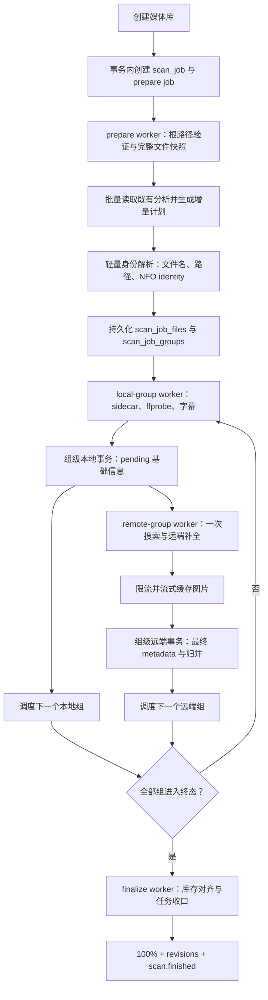

# 媒体库扫描与刮削架构

> 状态：分阶段实施中。批量音轨/字幕恢复、单类型严格 TMDB 匹配、扫描组级短事务、服务端权威进度、有界 local/remote 流水线、扫描检查点 SSE 和 Web 刷新合并已经落地。文件级持久化快照、跨进程扫描组恢复、公平子任务调度和流式图片下载仍是目标设计。

> 接口影响：没有删除 Mova 对外 HTTP 路由。`ScanJobResponse` 和 realtime active scan 增加三个任务计数，phase 收敛为 `discovering / processing / finalizing / finished`，扫描 item stage 收敛为 `analyzed / pending_committed / metadata / artwork / completed`。开发期协议仍为 `protocol_version = 1`，不保留未发布旧 payload 的兼容分支。
>
> 本文同时记录当前实现和后续目标。已经对外生效的 HTTP 与 SSE 字段以 [`API.md`](API.md) 和 [`REALTIME.md`](REALTIME.md) 为准；标记为目标的内容不得被客户端当成已实现契约。

本文定义从创建媒体库、读取文件系统、解析资源名称、建立电影或剧集扫描组、本地分析、远端匹配、图片缓存、数据库归并，到扫描任务完成和客户端恢复的完整目标流程。

## 1. 结论和优先级

当前实现已经具备持久化后台任务、增量扫描、服务端权威进度和单任务有界流水线。完整目标还要解决以下问题：

1. 把复用本地分析时的音轨、字幕 `2N` 查询改为固定最多 3 次批量查询。
2. 删除 TMDB 双类型检测：本地有明确季集坐标只搜索 TV，否则只搜索 movie；严格匹配后把 provider ID 直接交给详情接口。
3. 同一扫描组的本地写入和远端写入分别使用一个组级事务，每个事务最多执行一次孤儿结构清理。
4. 删除“全部本地组完成后才开始 TMDB”的全局阶段屏障，改为本地与远端可重叠的有界流水线。
5. 不再把整次扫描的完整分析结果保存在内存；数据库中的任务、文件和扫描组是可恢复检查点。
6. 只有完整文件系统快照成功后才允许删除缺失路径，避免挂载暂时不可访问时误删整个媒体库。
7. 图片改为限流、流式落盘和原子重命名，不再把完整响应一次性读入内存。

第 1～4 项已经落地；第 5 项已通过容量为 2 的进程内队列限制活跃组内存，并用最小 `scan_job_groups` 状态保证计数幂等，但尚未做到服务重启后从组级检查点续跑。第 6～7 项仍按本文目标架构分阶段实现。

### 1.1 前几轮已经确认的实施基线

后续实现以本清单为准，不再回到更早的讨论方案：

1. 创建媒体库后只负责创建 scan job 和 background job，HTTP 不持有扫描生命周期。
2. prepare 阶段先读取完整文件树并持久化安全快照；快照失败时不删除任何已有媒体。
3. 轻量名称解析先处理整个文件集合并完成分组，之后才进入组级完整本地分析。
4. 文件名明确包含 season + episode 才是剧集；否则按电影处理，目录印象不能替代季集坐标。
5. 同一电视剧跨多个季仍是一个 series group；组内按 season/episode 坐标组织。
6. 同一电影的 1080p、2160p 等版本先归为一个 movie group，最终成为一个 media item 下的多个 media file。
7. local worker 按组处理；单文件 `ffprobe` 可以串行，但任务并发和超时必须有界。
8. 复用本地分析时，媒体摘要、音轨、字幕固定最多 3 次批量查询，不执行逐文件 `2N` 查询。
9. 同一扫描组的本地写入使用一个短事务；远端写入再使用一个独立短事务；网络和文件 I/O 不进入事务。
10. 当前 local commit 后通过容量为 2 的进程内队列把组交给 remote worker，数据库记录最小扫描组状态用于幂等计数；目标实现再改为 remote worker 只按 `scan_group_id` 回查最小上下文，从而支持跨进程恢复。
11. local 和 remote 是有界流水线：前一组进入远端时，下一组可以继续本地分析；不等待全库本地分析完成。
12. TMDB 类型由本地季集坐标决定，只查一个 endpoint；不再同时搜索 movie 和 TV。
13. TMDB 自动匹配不计算分数：名称严格相等；有年份时年份必须完全相同；无年份时取严格同名候选中正式日期最新者；搜索与别名验证必须有界，查询过宽时失败关闭而不是制造无界远端请求。
14. 已有可信 provider ID 直接 fetch-by-id；一次搜索选中的 ID 直接进入详情请求，禁止再次按标题搜索。
15. TMDB 身份匹配成功后覆盖其负责的规范元数据；本地继续负责物理文件、技术信息、电影版本和季集坐标。
16. 海报、背景、Logo、季海报、单集剧照等使用标准化 artwork 集合；下载有界并发、流式落盘和原子 rename。
17. 演员不在扫库时全量预抓；读取单个 Mova 条目详情时按需获取、持久化并随详情返回。
18. 任务权威进度由服务端持久化：发现占 0～10，本地分析占 10～30，pending 入库占 30～50，远端处理占 50～99，最终成功提交为 100；local/remote 流水重叠时不会刻意停在 50，客户端不自行估算。
19. SSE 只承载临时扫描进度和资源失效通知；正式数据与 revision 仍从 PostgreSQL/API 恢复。
20. 当前阶段继续使用 PostgreSQL background jobs，不引入 NATS、JetStream、Kafka 或 Redis 强依赖。

## 2. 设计目标

### 2.1 必须满足

- HTTP 请求只负责创建业务记录和入队，不持有扫描生命周期。
- 扫描任务、扫描组和文件快照保存在 PostgreSQL，服务重启后可以继续。
- 单个超大媒体库不能长期占满全部 worker，多个媒体库之间需要公平调度。
- 文件系统、`ffprobe`、TMDB、OMDb 和图片下载都不得发生在数据库事务中。
- 本地名称解析负责确定可播放结构和唯一 TMDB endpoint：完整季集坐标使用 TV，否则使用 movie。
- TMDB 只在已选类型内确认作品身份；对应类型没有严格匹配就完成为未匹配，不搜索另一类型兜底。
- 每个正式数据事务与相应 resource revision 在同一事务内提交。
- SSE 可以丢失；客户端始终能通过状态接口和正式数据恢复。
- 扫描重试必须幂等，不得生成重复电影、重复季集或重复物理文件。

### 2.2 当前阶段不引入

- 不引入 NATS、JetStream、Kafka 或 Redis 作为强制依赖。
- 不把 SSE 当消息队列或可靠任务通道。
- 不在本轮支持一个物理文件同时映射多个连续单集，例如 `S01E01E02`。
- 不使用目录中的自然排序，凭空把无季集标记的文件依次推断为第 1、2、3 集。

PostgreSQL 同时承担可靠业务状态和现阶段任务队列。未来需要拆成 `mova-api`、`mova-worker`、`mova-realtime` 时，可以替换任务分发适配器，但不改变扫描状态模型和客户端协议。

## 3. 目标总体链路



这是一条流水线，不是两个全局串行阶段。某个组完成本地事务后即可进入远端队列，同时下一个组继续本地分析。默认同一扫描任务最多同时运行一个本地组和一个远端组，从而兼顾吞吐、资源上限和公平性。

## 4. 持久化状态模型

当前已经持久化任务级计数和最小扫描组检查点；后续目标再增加文件级工作快照。目标字段名称可以在编码时微调，但职责不得合并回无界的进程内临时状态。

### 4.1 `scan_jobs`

当前父任务保留一行，核心字段为：

```text
id
library_id
status
phase
total_files
scanned_files
local_analyzed_files
local_committed_files
remote_completed_files
progress_percent
created_at / started_at / finished_at
error_message
```

当前状态：

```text
pending
running
success
failed
```

当前 phase：

```text
discovering
processing
finalizing
finished
```

本地和远端处理允许重叠，因此不再把 `analyzing` / `enriching` 作为互斥任务 phase。扫描组自身记录更细的 local/remote 状态。

后续完整可恢复工作流可以增加 `planned_files`、`failed_files`、`snapshot_completed_at`、`cancel_requested_at`，以及 `partial_success / cancelled` 终态；这些尚不是当前 API 契约。

数据库增加部分唯一索引，保证每个媒体库最多一个 `pending/running` scan job；advisory lock 只用于减少冲突，不作为唯一正确性保障。

### 4.2 `scan_job_files`

每次扫描成功完成发现后，为快照中的每个支持视频保存一行：

```text
id
scan_job_id
scan_group_id
media_item_id
media_file_id
file_path
relative_path
file_size
modified_at_ms
scan_hash
local_context_hash
local_analysis_required
remote_refresh_required
local_status
remote_status
error_message
```

约束：

```text
unique(scan_job_id, file_path)
```

`scan_job_files` 只保存工作流身份、快照和执行状态，不复制完整 `ffprobe` JSON。完整本地分析一旦成功就写入正式 `media_files`、`audio_tracks` 和 `subtitle_files`，这些正式表本身就是远端阶段与重试的检查点。

`media_item_id / media_file_id` 在 prepare 后可以为空，由 local group transaction 在正式入库成功时写回；剧集文件的 `media_item_id` 指向单集条目，扫描组的 `target_media_item_id` 指向顶层 series。

正式 `media_files` 同步增加 `local_context_hash`，与现有 `scan_hash`、`local_analysis_version` 一起支持下一次增量决策。

### 4.3 `scan_job_groups`

当前最小 `scan_job_groups` 用于保证三个文件计数幂等：

```text
id
scan_job_id
group_key
file_count
local_analyzed
local_committed
remote_completed
created_at / updated_at
```

约束：

```text
unique(scan_job_id, group_key)
```

同一组重复提交不会重复增加任务计数。任务重试重新规划时会清空这些最小检查点；因此它目前不是跨进程续跑所需的完整工作快照。

完整可恢复目标中，一个逻辑电影或剧集仍对应一个扫描组，并扩展为：

```text
id
scan_job_id
group_key
group_key_source
local_media_type
lookup_title
lookup_year
file_count
target_media_item_id
remote_refresh_required
local_status
remote_status
metadata_provider
metadata_provider_item_id
remote_media_type
metadata_status
metadata_failure_reason
attempt_count
error_message
created_at / updated_at
```

推荐状态：

```text
local_status  = pending / running / succeeded / failed / reused
remote_status = blocked / pending / running / matched / unmatched / failed / skipped
```

`unmatched` 和 `skipped` 是业务终态，不是 worker 失败；`failed` 表示经过重试仍未完成的技术错误。

### 4.4 `background_jobs`

任务队列需要支持多个子任务关联同一个 scan job，因此删除当前“一个 scan job 只能对应一个 background job”的唯一约束，新增：

```text
queue_name
dedupe_key
related_scan_job_id
related_scan_group_id
priority
payload
status / attempt_count / max_attempts
run_after / lease_expires_at
```

`dedupe_key` 全局唯一，例如：

```text
scan:41:prepare
scan:41:group:88:local
scan:41:group:88:remote
scan:41:finalize
```

同一子任务重试复用原 job 行，不新增重复任务。

### 4.5 工作快照保留

`scan_jobs` 聚合历史可以长期保留；体积较大的 `scan_job_files`、`scan_job_groups` 和已完成 background jobs 需要定期清理：

- 活跃任务永不清理。
- 成功、部分成功和取消任务的工作快照默认保留 7 天。
- 失败任务默认保留 30 天用于诊断。
- 保留期通过配置修改。

## 5. Worker 队列与公平调度

目标 job 类型：

| job type | 职责 |
| --- | --- |
| `library.scan.prepare` | 发现、快照、增量计划和扫描组持久化 |
| `library.scan.local-group` | 单个扫描组的完整本地分析与基础写入 |
| `library.scan.remote-group` | 单个扫描组的远端决策、详情、图片和最终写入 |
| `library.scan.finalize` | 删除缺失路径、收口统计和完成父任务 |

调度规则：

1. 一个媒体库同一时刻只允许一个活跃 scan job。
2. prepare 完成后只调度该扫描的第一个 local group，不一次性把数千个组全部压入队列。
3. local group 提交成功的同一事务中，把该组标记为 `remote_status = pending`，再调用统一 scheduler。
4. 同一扫描最多一个 local job 和一个 remote job 处于 `pending/running`。
5. scheduler 在没有活跃 remote job 时，从已经 local terminal 的 pending 组中调度最早一组；已有 remote job 时不提前堆积更多 remote job。
6. scheduler 同时按顺序调度下一个 local group。
7. 全部扫描组进入 terminal 后，以唯一 `dedupe_key` 调度 finalize。
8. 不同扫描任务可以被不同 worker 并行处理，因此一个大库不会阻塞其它库。

默认资源上限建议：

```text
prepare workers        = 1～2
local-group workers    = min(2, CPU 核数)
ffprobe per scan       = 1
remote-group workers   = 4
remote per scan        = 1
artwork downloads      = 4（全局）
database finalizers    = 2
```

所有值都通过环境变量配置。多个服务实例部署时，并发限制必须由 PostgreSQL job claim 和 `queue_name / related_scan_job_id` 约束保证，不能只依赖单进程 semaphore。

## 6. 创建媒体库与扫描入队

### 6.1 请求前校验

管理员提交：

```text
name
description
metadata_language
root_path
```

应用层在打开数据库事务前完成：

1. 名称、描述和路径去除首尾空白。
2. 空描述变为 `null`。
3. 元数据语言归一化。
4. 根路径必须存在、可读并且是目录。
5. 服务不自动创建媒体根目录。

### 6.2 原子创建

目标实现把以下写入放到同一个数据库事务：

1. 插入 `libraries`。
2. 插入 `scan_jobs(status = pending)`。
3. 插入 `background_jobs(job_type = library.scan.prepare)`。
4. 提交事务。
5. 提交成功后通过 PostgreSQL `NOTIFY` 或进程内 notifier 唤醒 worker；轮询仍作为通知丢失的兜底。

这样不会再出现“媒体库创建成功，但首次扫描没有入队”的半完成状态。

## 7. 文件发现与安全快照

### 7.1 发现规则

prepare worker 从 `root_path` 递归遍历普通文件，只接受：

```text
mp4, mkv, avi, mov, m4v, wmv, flv, webm, mpg, mpeg
```

发现阶段只读取：

- 绝对路径和相对媒体库路径
- 文件大小
- 修改时间，毫秒精度
- 同目录可能相关的 NFO、本地图片和外挂字幕的路径、大小、修改时间

遍历每个目录时一次建立 companion 文件索引，再关联到目录内视频；不要为每个视频重复读取同一目录。此阶段不读取 companion 内容、不运行 `ffprobe`，也不下载 metadata。结果按相对路径排序，并以固定大小的 chunk 批量写入 `scan_job_files`，避免把整个目录快照永久保留在内存。

### 7.2 挂载安全规则

缺失路径删除必须遵守以下顺序：

1. 根目录存在、是目录且可读。
2. 完整递归遍历成功，没有中途 I/O 错误。
3. 文件快照完整写入数据库。
4. `snapshot_completed_at` 提交成功。
5. finalize 阶段才比较正式 `media_files` 和本轮快照，删除缺失路径。

如果根路径不存在、容器挂载丢失、权限不足或遍历中断：

- 扫描任务失败。
- 保留已有正式媒体数据。
- 不执行任何缺失路径删除。

目标实现删除当前“发现之前先逐条检查并删除已有路径”的行为。

### 7.3 扫描 hash

首个目标版本继续使用：

```text
scan_hash = file_size + modified_at_ms
local_context_hash = hash(按路径排序后的相关 NFO/图片/外挂字幕 path + size + mtime)
```

两者都是快速变化指纹，不是内容校验 hash。`local_context_hash` 保证只修改 NFO、封面或外挂字幕时也能触发正确的本地更新。后续如需检测 NAS 保留 mtime 的内容替换，可增加可配置的首尾采样 hash，但不能默认读取整个大文件。

### 7.4 扫描期间文件变化

文件系统快照不是文件系统事务。local worker 在分析文件前重新读取 size/mtime：

- 与快照一致：继续处理。
- 已变化：更新该文件快照和计划，重新排队当前组。
- 连续变化超过最大重试次数：标记 `file_changing` 技术失败，不读取一个仍在写入的文件。

finalize 删除快照中缺失的旧数据库路径前，再确认路径当前仍不存在。扫描完成后才出现的新路径留给下一次扫描，不会被误删。

## 8. 批量增量计划

快照完成后，prepare worker 按 chunk 用轻量摘要查询读取已有 `scan_hash`、`local_context_hash`、分析版本和 metadata 状态，并为每个文件决定：

```text
unchanged
local_only
local_and_remote
remote_only
```

### 8.1 固定查询次数恢复本地分析

prepare 不加载音轨和字幕。只有 local-group worker 确实需要把未变化文件与新文件一起组装提交时，才调用新增仓储接口：

```text
load_existing_local_analysis_by_paths(library_id, paths)
```

对一个包含 N 个路径的扫描组或 chunk，最多执行 3 次查询：

1. 批量读取 `media_items + media_files + episodes + seasons` 摘要。
2. 按 `media_file_id = ANY($1)` 批量读取全部音轨。
3. 按 `media_file_id = ANY($1)` 批量读取全部字幕。

应用层用 `HashMap<media_file_id, Vec<Track>>` 组装结果。不要把音轨和字幕同时 join 到一个明细查询中，否则会形成音轨数 × 字幕数的笛卡尔重复。纯 remote-only 组只更新 metadata，不需要读取音轨和字幕。

查询次数必须与 N 无关。默认 chunk 建议为 500～1000 个路径，避免单个 `ANY` 参数和返回集过大。

### 8.2 增量决策

#### `unchanged`

同时满足以下条件：

- 同路径已存在。
- `scan_hash` 一致。
- `local_context_hash` 一致。
- `local_analysis_version` 等于当前版本。
- metadata 已经进入可接受终态。
- 不需要更换语言、补 provider ID 或重新缓存远端图片。

此类文件不执行名称重解析、sidecar、`ffprobe`、TMDB 和正式数据 upsert，在生成计划时直接计入 local/remote 已完成权重。

#### `remote_only`

文件没有变化且本地分析版本有效，但符合以下任一条件：

- `metadata_status` 为 `pending`、`unmatched` 或 `failed`。
- 之前是 `skipped`，现在 provider 已启用。
- 缺少 provider ID 或 `remote_media_type`。
- 元数据语言发生变化。
- 海报或背景仍是远端 URL，尚未缓存到本地。
- 当前规则要求重新确认类型或重新本地化标题。

该文件复用批量加载的本地技术信息，不运行 `ffprobe`。

#### `local_only`

用于只影响本地技术或播放数据、而已有 provider 绑定仍可信的变化，例如：

- 外挂字幕新增、删除或改名。
- 本地图片变化，但不需要重新选择远端条目。
- 视频容器内容变化，需要重跑 `ffprobe`，但逻辑电影/剧集身份和 provider ID 没有变化。

local commit 后直接把该文件的 remote 部分计为完成，不调度 TMDB。若重新解析后发现标题、年份、季集身份或 provider identity 发生变化，计划升级为 `local_and_remote`。

#### `local_and_remote`

用于：

- 新文件。
- 大小或 mtime 变化。
- 文件或 companion 变化导致逻辑身份发生改变。
- 本地分析版本变化。
- sidecar 解析规则发生需要强制重跑的版本变化。

### 8.3 同组混合计划

一个扫描组可以同时包含 unchanged、remote-only 和 local-and-remote 文件。例如同一电影目录新增 2160p 版本时：

- 旧 1080p 文件复用本地分析。
- 新 2160p 文件运行 `ffprobe`。
- 旧版本已有完整可信匹配时，新版本直接继承该 movie item 和 provider binding，不请求 TMDB。
- 没有可信匹配或 metadata 需要刷新时，两个版本共用最多一次远端匹配/详情获取。
- 最终在一个远端事务中归并到同一电影。

## 9. 资源名称解析规范

名称解析输出结构化身份，并直接决定目标 TMDB 类型：

```text
LocalMediaIdentity {
  raw_stem
  display_title
  source_title
  normalized_title
  year
  season_number
  episode_number
  episode_title
  release_tags
  evidence
  confidence
  provider_kind       # season + episode => tv；否则 movie
}
```

### 9.1 解析顺序

1. 保留原始 file stem，用于诊断。
2. 解码基础 HTML entity。
3. 对匹配 key 执行 Unicode NFKC，统一常见全角字符。
4. 把 `. _ - – —` 视为词分隔符，合并空白。
5. 优先识别季集标记。
6. 从右向左识别发布规格和年份。
7. 剩余有效 token 构成标题。
8. 读取轻量 NFO identity，补充标题、年份和 provider ID，但不运行 `ffprobe`。

展示标题可以保留有意义的原始标点；`normalized_title` 只用于分组、去重和远端查询。

### 9.2 发布规格

至少识别：

```text
2160p, 1080p, 720p, 480p
x264, x265, H264, H265, HEVC
BluRay, BDRip, WEBRip, WEB-DL, WebDL, HDRip, DVDRip, REMUX
AAC, DTS, 8bit, 10bit
DV, DoVi, Dolby Vision, HDR, HDR10, HDR10+, SDR
```

这些 token 从标题中移除，并可以进入 `release_tags`，但不参与逻辑媒体身份。

### 9.3 年份

年份范围为 1900～2100。目标解析器从右向左选择最靠近发布规格或文件尾部的合理年份，避免把片名本身的数字年份提前截断。

示例：

| 文件名 | 标题 | 年份 |
| --- | --- | --- |
| `1917.2019.2160p.mkv` | `1917` | 2019 |
| `2001.A.Space.Odyssey.1968.mkv` | `2001 A Space Odyssey` | 1968 |
| `The.Boys.S02E01.2020.mkv` | `The Boys` | 2020 |

文件名和 NFO 都有年份时，NFO 年份用于展示和远端查询；文件名年份仍保留为解析证据，便于诊断冲突。

### 9.4 季集标记

高置信度标记：

```text
S01E01
s1e2
1x03
第1季第2集
```

上下文置信度标记：

```text
S01E01.mkv
E01.mkv
01.mkv
```

上下文标记只有同时满足以下条件才视为剧集：

1. 文件位于明确季目录中，例如 `Season 01`、`S01`、`第1季`。
2. 季目录上一级存在非通用剧名目录。
3. 季号没有冲突。

因此目标行为为：

| 路径 | 本地猜测 |
| --- | --- |
| `Arcane.S01E01.mkv` | 剧集 S01E01，标题 Arcane |
| `Arcane/Season 01/S01E01.mkv` | 剧集 S01E01，标题来自 Arcane 目录 |
| `Arcane/Season 01/E02.mkv` | 剧集 S01E02，标题来自 Arcane 目录 |
| `Arcane/Season 01/02.mkv` | 剧集 S01E02，低于显式标记但上下文足够 |
| `Arcane/Season 01/Pilot.mkv` | 不自动编号，保持电影/待复核本地猜测 |
| `/media/S01E01.mkv` | 根目录没有剧名上下文，不判为剧集 |

`Episode 2`、`Ep 2`、`第2集` 可以作为已经确认季集身份后的通用单集标题并被忽略，但不能单独创造季集身份。

### 9.5 单集标题

显式季集标记之后、年份或发布规格之前的文本作为 `episode_title`。如果结果只是：

```text
Episode N
Ep N
第N集
```

则保存为 `null`，等待 TMDB outline 提供正式单集标题。

### 9.6 NFO identity

轻量身份阶段读取同名 `.nfo`，电影可后备读取 `movie.nfo`。目标增加解析：

```text
title
originaltitle
sorttitle
year
uniqueid type="tmdb"
tmdbid
```

provider ID 是最高优先级的本地分组证据，但 NFO 中的 ID 在远端校验成功前不算可信绑定。NFO 标题和年份可覆盖展示/查询值，但文件名解析出的 `source_title` 不丢失。

## 10. 扫描组建立策略

`group_key_source` 保存可读的规范身份，`group_key` 保存其稳定 hash。所有目录部分都使用相对媒体库根路径，避免容器挂载前缀变化导致组身份变化。

### 10.1 剧集组优先级

按以下优先级选择第一个可用身份：

1. NFO 或已有绑定中的 TMDB series ID：

   ```text
   series:tmdb:<provider_item_id>
   ```

2. 明确季目录之前的相对系列容器路径：

   ```text
   series:path:<relative-series-container>
   ```

3. 无季目录但位于非通用直接父目录中的剧集：

   ```text
   series:parent:<relative-parent>:<normalized-title>:<year-or-none>
   ```

4. 平铺在媒体库根目录时：

   ```text
   series:title:<normalized-title>:<year-or-none>
   ```

通用目录包括：

```text
movie, movies, film, films, media, video, videos
series, shows, tv, tv shows
电影, 剧集, 电视剧, 动画, 动漫
```

版本目录 `DV`、`DoVi`、`Dolby Vision`、`HDR`、`HDR10`、`HDR10+`、`SDR` 和包含“杜比”的目录不会成为剧集容器身份的一部分。

示例：

```text
The Boys/Season 01/The.Boys.S01E01.mkv
The Boys/Season 02/The.Boys.S02E01.mkv
```

二者都归入 `series:path:The Boys`，年份只作为查询提示，不作为跨季拆组条件。

所以“组”代表整部电视剧，不代表单季。Season 01、Season 02 和后续季共享一个 series group；组内再按 `season_number` 拆成多个 season，并按 `episode_number` 拆成单集。整部剧只选择一次 TMDB series ID，之后只请求本地实际存在季号的 outline。

与当前仅按标题回退不同，目标方案在存在非通用父目录时把相对父目录加入身份，避免两个不同目录中的同名剧集意外合并。

### 10.2 电影组优先级

1. NFO 或已有绑定中的 TMDB movie ID：

   ```text
   movie:tmdb:<provider_item_id>
   ```

2. 位于非通用电影目录时：

   ```text
   movie:parent:<relative-parent>:<normalized-title>:<year-or-none>
   ```

3. 平铺在库根目录时：

   ```text
   movie:title:<normalized-title>:<year-or-none>
   ```

同一目录中的以下文件在扫描阶段就进入一个电影组：

```text
Avatar Fire and Ash (2025)/Avatar.Fire.and.Ash.2025.1080p.mkv
Avatar Fire and Ash (2025)/Avatar：Fire.and.Ash.2025.2160p.mkv
```

这样只做一次远端决策，并在组级事务中直接保存为一个电影的多个资源版本。组内已有可信 provider ID 且顶层 metadata、语言和图片缓存都有效时，不搜索也不重新获取详情，只把新增物理文件挂到已有 movie item；需要刷新 metadata 时也只按已有 ID 获取一次详情。不同目录最终获得同一 provider ID 时，仍在远端事务中执行权威归并。

### 10.3 组内冲突

如果一个候选组内出现互相冲突的显式身份，例如两个不同 TMDB ID、不同剧集标题或同一文件被解析为电影和剧集：

- 不选择“多数派”静默覆盖。
- 按更高优先级身份拆组。
- 无法确定时把冲突文件拆为独立 review group。
- 记录结构化 `grouping_conflict`，供管理页面和日志查看。

### 10.4 最终数据库结构

电影：

```text
movie media_item
  ├─ media_file 1080p
  └─ media_file 2160p
```

剧集：

```text
series media_item
  └─ season
      └─ episode media_item + episode
          ├─ media_file version A
          └─ media_file version B
```

目标 schema 增加电影/剧集 provider 身份的部分唯一约束，保证同一库、同一顶层类型、同一 provider ID 最终只有一个顶层条目。单集条目不使用剧集 provider ID 参与该唯一约束。

## 11. Local-group：完整本地分析

local worker 读取一个 `scan_job_group` 及其文件列表，在数据库事务外执行 I/O：

1. 对 `local_analysis_required = true` 的文件重新解析完整文件名和 NFO。
2. 查找本地海报、背景图和单集图片。
3. 按文件运行一次 `ffprobe`。
4. 解析容器、时长、视频参数、HDR/Dolby Vision、音轨和内嵌字幕。
5. 扫描并关联外挂字幕。
6. 对 `local_analysis_required = false` 的文件使用 prepare 阶段批量恢复的已有分析，或在 worker 中按整个组一次批量加载。

默认同一扫描中 `ffprobe` 并发为 1。不同扫描任务可以受全局 local worker 上限控制并行，因此不会让一个库内部同时读取大量大文件，也不会阻塞其它库。

### 11.1 NFO metadata

完整本地阶段在 identity 字段之外继续读取：

```text
title
originaltitle
sorttitle
year
plot（缺少时使用 outline）
thumb
fanart
```

NFO 标题、年份和简介优先于文件名占位值；`source_title` 仍保留文件名来源。NFO 图片引用只在指向有效本地文件或允许的远端 URL 时使用，空值不覆盖已有图片。

### 11.2 本地图片

支持：

```text
jpg, jpeg, png, webp, avif
```

文件专属海报：

```text
<stem>.jpg
<stem>-poster.jpg
<stem>.poster.jpg
```

通用海报：

```text
poster.jpg
folder.jpg
cover.jpg
```

文件专属背景图：

```text
<stem>-fanart.jpg
<stem>-backdrop.jpg
<stem>-background.jpg
```

通用背景图：

```text
fanart.jpg
backdrop.jpg
background.jpg
```

剧集文件的专属图片属于单集；通用目录图片可以作为剧集级图片，但单集剧照不得提升为剧集海报。

### 11.3 外挂字幕

支持：

```text
srt, ass, ssa, vtt
```

优先按去除语言/属性后缀后的 stem 精确匹配；其次按同一季集号匹配。存在多个同季集视频且无法唯一归属时不自动关联。

语言和属性至少解析：

```text
zh / chs / zh-CN
en / eng
forced / foreign
default
sdh / cc / hi
```

## 12. 组级本地事务

本地分析完成后先通过 `scan_job_groups.local_analyzed` 幂等增加 `local_analyzed_files`，再打开一个短媒体事务：

1. `SELECT ... FOR UPDATE` 锁定 `scan_job_groups` 当前行并校验状态仍可提交。
2. 批量 upsert 组内顶层媒体、季、单集和 `media_files`。
   - 把产生或复用的顶层 `media_item_id` 写回 `scan_job_groups.target_media_item_id`。
   - 把每个文件对应的 `media_item_id / media_file_id` 写回 `scan_job_files`。
3. 对需要更新的 media file，批量替换音轨和字幕：
   - 一次批量删除旧集合。
   - 一次多行 insert / `UNNEST` 写入新集合。
4. 需要远端刷新的组把 metadata 标为 `pending`；local-only 组保留原 metadata 终态；provider 未启用的新组直接标为 `skipped / provider_disabled`。所有情况都保留已有 provider 绑定和旧图片，本地事务不允许清空 artwork。
5. 每个受影响的旧顶层结构只在组末尾清理一次；不要在每个物理文件 upsert 后调用孤儿清理。
6. 把 group `local_status` 更新为 `succeeded` 或 `reused`；需要且能够远端刷新的组变为 `remote_status = pending`，纯 local-only 或 provider-disabled 组直接进入相应远端终态并计入 remote completed。
7. 以组的 `file_count` 原子增加父任务 `local_committed_files`。
8. 当前实现在同一事务末尾增加一次 `library:{id}:catalog` revision；任务进度直接通过 SSE 发送，不逐组增加 scan revision。
9. 当前事务提交后把组写入容量为 2 的 remote channel；完整持久化目标再改为事务内调度 remote/local 子任务。
10. 分析和 pending 提交事件都只在对应状态成功持久化后发送。

本地事务不得执行：

- 文件读取
- `ffprobe`
- TMDB / OMDb 请求
- 图片下载
- JSON 大对象解析

事务失败时整组回滚，重试相同 dedupe job；不会留下“部分集已更新、部分集未更新”的组内半完成状态。

## 13. Remote-group：一次单类型严格搜索完成匹配

TMDB 当前 endpoint、真实评分漏洞、字段覆盖和目标对接契约见 [`TMDB.md`](TMDB.md)。本节只保留扫描 worker 需要遵守的调度与事务要求。

第一批重构已经删除 `detect_media_type()`、movie/TV 双查和正式 `lookup()` 的重复标题搜索。当前 provider 主链路按以下职责运行，后续继续补齐 typed `MatchDecision` 和持久化诊断：

```text
provider_kind(local_identity) -> movie | tv
search_candidates(kind, query, optional_year) -> CandidateSet
verify_exact_alternative_titles(kind, candidate_ids, title) -> ExactAliasSet
select_exact_candidate(candidate_set, title, optional_year) -> MatchDecision
fetch_movie_details_by_id(id, language) -> MovieMetadata
fetch_series_details_by_id(id, language) -> SeriesMetadataWithSeasonSummaries
fetch_series_seasons_by_id(id, season_numbers, language) -> SeriesOutline
```

严禁 `fetch_*_details_by_id` 内部再次按标题搜索。

### 13.1 最小组级回查

remote job 的持久化 payload 只保存 `scan_group_id`，不携带上一阶段的完整分析对象。worker 领取任务后调用：

```text
load_remote_group_context(scan_group_id) -> RemoteGroupContext
```

返回内容只包括：

- 组的本地类型、lookup title/year 和是否需要远端刷新。
- `target_media_item_id`、已有 provider ID、remote type 和 metadata 完整性。
- 组内 `media_item_id / media_file_id`。
- 剧集需要的本地 `season_number / episode_number` 集合。

查询预算：

- 电影组最多 1 次 SQL。
- 剧集组最多 2 次 SQL：组/顶层信息一次，本地季集坐标一次。
- 不读取音轨、字幕、视频编码和完整 `ffprobe` 数据。

数据库是阶段间的权威检查点，因此即使 local 和 remote 被不同 worker、不同进程执行也能恢复。进程内可以缓存 `RemoteGroupContext` 作为优化，但 cache miss、服务重启或切换实例时必须得到同样结果，内存不得成为正确性来源。

local commit 成功后应主动释放包含 `ffprobe`、音轨、字幕和图片候选的完整本地分析对象，这是有意的内存边界。remote worker 的电影上下文查询可以与 background job claim 合并为一个 SQL/CTE；剧集只再补一次季集坐标查询，因此它不是重新全量读取媒体库。

第一版不需要实现进程内 handoff cache。只有指标证明这 1～2 次索引查询成为瓶颈后，才增加按 `scan_group_id` 的短生命周期 read-through cache；不得为了省这次查询让 remote job 依赖 local worker 仍然存活。

### 13.2 决策顺序

1. 用本地结构确定唯一 provider kind：完整 `season_number + episode_number` 为 TV，否则为 movie。
2. 数据库中已有 `matched` 且 provider kind 一致的可信 provider ID：始终跳过搜索。metadata、语言和图片缓存仍有效时完全跳过 TMDB；确实需要刷新时才按 ID 获取一次详情。
3. 只有 NFO provider ID：按唯一 provider kind fetch-by-id，并用当前严格名称/年份规则校验；失败则丢弃该 ID，进入搜索。
4. 没有可信绑定：只调用 provider kind 对应的一个 search endpoint。
5. 标准化名称必须与 localized title/name、original title/name 或经 alternative titles 验证的别名完全相等。
6. 本地有年份时，候选年份必须完全相同；没有严格结果时直接完成为 `no_remote_match`，不移除年份重试。
7. 本地没有年份时，从严格同名候选中按完整发行/首播日期降序选择唯一最新 ID。
8. 无候选完成为 `no_remote_match`；最新结果不唯一或全部缺日期完成为 `ambiguous_remote_match`。
9. 选中的 provider ID 直接传给详情接口，不再按标题搜索。

查询候选顺序：

1. NFO/组的 lookup title + 可选 year。
2. Unicode/纯排版标准化后的 source title + 可选 year。
3. 中文元数据模式下明确识别出的中文容器标题 + 可选 year。
4. 多个本地查询名称逐个严格执行，但同一个标准化名称只请求一次。
5. 本地有 year 时所有请求都必须携带 year；不执行无年份 fallback。

### 13.3 严格选择规则

自动匹配完全删除评分：

- 不计算 title score、year score、MatchRank 或相似度。
- 不使用前缀、包含、编辑距离或 popularity。
- 名称标准化只消除大小写、空白、常见分隔符和全角/半角等排版差异，不改变词义。
- 有年份：名称和年份必须同时完全相等，缺日期也不接受。
- 无年份：名称必须完全相等；结果不超过 20 页时遍历全部页后，再按完整日期选择最新，不能把第一页或 provider 返回顺序当成“最新”；超过上限说明查询过宽，自动匹配失败关闭并交给手动匹配。
- alternative titles 只能把一个名称验证为“完全相等”，不能产生软分数。
- localized/original title 已有严格候选时不请求 alternative titles；只有完全没有直接候选时才验证别名，且单次最多验证 40 个候选。

目标行为：

| 本地结构 | 唯一查询 | 远端结果 | 结果 |
| --- | --- | --- | --- |
| 明确季集 | TV | 名称、年份严格相等 | 选中 series ID，继续补全 |
| 明确季集 | TV | 本地无年份，存在同名候选 | 选择首播日期最新的唯一 series ID |
| 明确季集 | TV | 无严格候选 | `unmatched / no_remote_match`，不查 movie |
| 无季集坐标 | movie | 名称、年份严格相等 | 选中 movie ID，继续补全 |
| 无季集坐标 | movie | 本地无年份，存在同名候选 | 选择发行日期最新的唯一 movie ID |
| 无季集坐标 | movie | 无严格候选 | `unmatched / no_remote_match`，不查 TV |
| 任意 | 唯一类型 | 最新候选不唯一或全部缺日期 | `unmatched / ambiguous_remote_match` |
| 任意 | 唯一类型 | provider 请求失败且重试耗尽 | `failed / metadata_provider_error` |
| 任意 | 唯一类型 | provider 未启用 | `skipped / provider_disabled` |

本地结构同时决定文件怎样播放以及请求哪个 TMDB endpoint；一旦严格确认是同一作品，TMDB ID 和规范元数据成为远端身份权威，不应继续保留文件名占位元数据。

### 13.4 搜索缓存和限流

- 扫描内缓存 key：`provider + kind + language + normalized_title + year`。
- 相同电影的多个本地版本共享扫描组，因此天然只搜索一次。
- 多个组仍出现相同查询时，进程内 single-flight 合并并发请求。
- 多实例阶段可以增加带短 TTL 的 PostgreSQL provider query cache，但不能把搜索结果当永久业务状态。
- TMDB 请求使用全局 rate limiter；收到 `429` 时遵循 `Retry-After` 并退避，不让每个 worker 独立重试形成放大。

## 14. 远端详情、剧集大纲和图片

### 14.1 电影详情

选定 movie ID 后只调用详情接口，并通过 `append_to_response` 同请求获取 `external_ids,images,release_dates`，写入：

- TMDB provider ID
- 标题、原始标题、完整发行日期、年份、简介和 tagline
- 原始语言、国家、题材、制作公司、时长、状态和电影合集
- TMDB vote average/count，以及按地区选择的 release/certification
- 海报、背景图和 logo 候选及其语言、尺寸和投票信息
- 可用的 IMDb/Wikidata ID；演职员保持首次使用时按需获取并持久化，不在扫库时为全部条目预抓

OMDb 评分是可选增强。OMDb 失败不能让已经成功匹配的 TMDB 条目变成 `failed`；只记录评分缺失和诊断日志。

### 14.2 剧集详情与 outline

选定 series ID 后：

1. 获取一次剧集详情，并通过 `append_to_response` 同请求获取 `external_ids,images,content_ratings`；aggregate credits 保持首次使用时按需获取并持久化。
2. 复用该详情响应中的 season summaries；outline 阶段不得再次获取 TV details。
3. 只获取本地实际存在季号的季详情，不默认遍历 TMDB 返回的全部季。
4. 对目标季中的本地实际集号映射标题、简介和剧照。
5. 同一 series ID + language 的 outline 在一次扫描中缓存。
6. 已有未过期的正式 `series_episode_outline_cache` 可以直接复用；缺少的季再增量补充。

这比当前“获取远端所有正数季”更节省请求，也避免一个本地只有一季的长寿剧集拉取几十季数据。

### 14.3 条目详情按需演员

- 扫描阶段不为全部电影和剧集获取 credits。
- 目标 `GET /api/media-items/{id}` 先返回主体详情所需的本地数据，并检查持久化演员集合。
- 演员为空且存在可信 provider ID 时，在该详情请求内调用 movie credits 或 TV aggregate credits，最多持久化 top 20，并直接作为详情响应的 `cast` 返回。
- 如果该次请求同时刷新远端主体详情，则通过 `append_to_response=credits` 或 `aggregate_credits` 合并 HTTP round-trip。
- 演员请求失败不阻断主体详情；返回空 `cast` 并保留可重试状态。
- 目标落地后，客户端不再必须调用单独的 `/api/media-items/{id}/cast`；旧接口在 pre-1.0 阶段直接删除，不保留双契约。

### 14.4 图片缓存

图片下载规则：

- 海报、背景图、季海报和集剧照只写各自层级和字段，不互相兜底。
- movie/TV `/images` 返回的 posters、backdrops、logos，以及 season posters、episode stills、person profiles、company/network logos，统一写入 `provider_artworks` 集合；默认展示字段只是被选中的引用。
- 使用全局有界并发，默认 4。
- 设置连接和响应超时，默认单张 30 秒。
- 校验 HTTP 状态和 `Content-Type: image/*`。
- 默认单张最大 20 MiB，超过上限中止。
- 使用流式 body 写入同目录临时文件，不把完整 body 读入内存。
- 写入完成后 `fsync`（按平台能力）并原子 rename 到稳定 hash 路径。
- 相同 URL 使用 single-flight，避免并发重复下载。
- 已存在且大小大于 0 的稳定缓存文件直接复用。
- 下载失败保留原有本地缓存图，不因一次网络错误清空 artwork。

## 15. 组级远端事务

所有网络和图片工作完成后，remote worker 打开一个短事务：

1. 锁定扫描组，确认 `local_status` 已 terminal 且 `remote_status` 仍可提交。
2. 写入组级远端决策和 provider ID。
3. 只更新 metadata 相关字段，不重新写入 `ffprobe`、音轨和字幕。
4. 电影按 provider ID 查找并锁定权威目标 movie item，把组内所有 media file 一次性归并到目标。
5. 剧集按 provider ID 查找并锁定权威 series，批量 upsert 本地实际存在的季和单集 metadata。
6. 每个被合并的旧顶层结构只在组末尾清理一次。
7. 更新 `metadata_status`：`matched` / `unmatched` / `failed` / `skipped`。
8. 把 group `remote_status` 更新为对应终态，并以组 `file_count` 增加父任务 `remote_completed_files`。
9. 在同一事务内增加 catalog/scan revisions。
10. 调度下一个 remote group；全部组 terminal 时调度 finalize。
11. 提交成功后发送 `scan.progress` 的 `completed` 组更新。

远端事务不能通过构造完整 `CreateMediaEntryParams` 再覆盖整条本地数据。目标仓储接口应明确拆分：

```text
commit_local_scan_group(...)
apply_remote_scan_group_result(...)
```

这样远端补全不会第二次删除并重建音轨、字幕，也不会意外覆盖刚写入的技术参数。

### 15.1 Revision 写入策略

扫描组事务已经在事务内设置 `mova.defer_catalog_revision = on`，让媒体项、文件、季和单集的逐行 trigger 跳过本次 catalog bump；组内数据、扫描组状态和任务计数全部成功后，事务末尾显式增加一次 `library:{id}:catalog` revision。local pending 事务和 remote 最终事务各增加一次，数据与 revision 同提交、同回滚。

`library:{id}:scan` revision 在任务创建以及父任务状态变化时增加，包括首次运行、等待重试、重新运行和进入终态；普通组进度直接通过 `scan.progress` 提供，不用每组 revision 迫使客户端回查扫描任务。非扫描业务写入仍使用逐行 trigger，后续增加新的批量写仓储时也应采用“事务内延迟 trigger + 聚合末尾显式 bump 一次”，并补集成测试防止数据已提交但 revision 未更新。

## 16. Finalize：库存对齐与任务收口

finalize 只在以下条件满足时运行：

- 文件快照完整。
- 所有扫描组 local terminal。
- 所有可以进入远端的扫描组 remote terminal。
- 没有仍为 pending/running 的子任务。

执行顺序：

1. 根据 `scan_job_files` 快照计算正式库中缺失的 `media_files.file_path`。
2. 在一个库级事务中批量删除缺失 media file；超大集合按固定 chunk 删除，但孤儿结构清理只在最后一次执行。
3. 清理没有资源的电影、单集、季和剧集。
4. 汇总业务未匹配数和技术失败数。
5. 写入父任务终态和 `progress_percent = 100`（仅成功或部分成功）。
6. 同事务增加 `library:{id}:catalog`、`library:{id}:scan` 和必要的首页 revision。
7. 提交后发送 `scan.finished`。

终态规则：

| 状态 | 条件 |
| --- | --- |
| `success` | 工作流完成，没有耗尽重试的技术错误；`unmatched` / `skipped` 可以存在 |
| `partial_success` | 快照和库存对齐成功，但部分组存在耗尽重试的本地或远端技术错误 |
| `failed` | 快照失败、核心状态损坏、没有任何有效提交，或 finalize 失败 |
| `cancelled` | 用户删除库、配置变化替换任务或显式取消 |

`unmatched` 是业务结果，不应让整个扫描任务变成 `partial_success`。

## 17. 服务端权威进度

发现阶段没有可靠总数，显示 phase 和 `scanned_files`，`progress_percent` 单调位于 1～10。文件树、增量计划和浅层分组全部完成后，以物理文件数作为权重：

```text
analyzed_ratio  = local_analyzed_files  / total_files
committed_ratio = local_committed_files / total_files
remote_ratio    = remote_completed_files / total_files

progress = floor(
  10
  + 20 * analyzed_ratio
  + 20 * committed_ratio
  + 49 * remote_ratio
)
```

运行中最大为 99，finalize 成功或部分成功后写 100。

语义：

- 发现完成：10。
- 如果全部本地分析完成、尚未 pending 入库：30。
- 如果全部 pending 入库完成、尚无远端组完成：50。
- 本地与远端重叠时，两部分贡献可以同时增加，不要求任务先停在 50。
- 全部远端组进入业务或技术终态：99。
- 库存对齐和父任务提交成功：100。

计数规则：

- unchanged 文件在计划生成时同时计入 analyzed、committed 和 remote completed。
- 完整本地分析成功后，先通过 `scan_job_groups.local_analyzed` 幂等推进 analyzed 计数；这一步不代表正式媒体数据已经提交。
- pending 组事务成功后，通过 `local_committed` 幂等推进 committed 计数；事务失败不会增加 committed。
- remote-only 文件直接计入 analyzed 和 committed，远端提交后计入 remote completed。
- local-only 文件在本地组事务提交后同时完成其 remote 权重，不发起 provider 请求。
- local group 重试耗尽时，保留该组已有正式数据，把 local/remote 都标为技术终态并增加 `failed_files`；该组的两部分权重都计为完成，使任务能够进入 `partial_success` finalize。
- 一个剧集组完成远端事务时，按该组 `file_count` 增加 remote completed，而不是只增加 1。
- `matched`、`unmatched`、`skipped` 和耗尽重试后的 `failed` 都是远端 terminal，因此都计入完成度。
- 所有计数通过 SQL 原子增加，`progress_percent` 使用 `greatest(old, calculated)` 保证不会回退。

条目级 `30 / 40 / 60 / 85 / 100` 只用于临时卡片动画，分别对应 `analyzed / pending_committed / metadata / artwork / completed`，不参与任务级进度。

## 18. SSE、HTTP 恢复和三端通用性

### 18.1 SSE

保留两类扫描事件：

```text
scan.progress
scan.finished
```

`scan.progress`：

- 按 `(scan_job_id, scan_group_id)` latest-wins。
- 最多每 200ms 批量发送一次。
- 普通进度在 dispatcher 饱和时允许丢失。
- 只在对应事务提交后发送，不能展示尚未提交的图片或 metadata。
- 本轮存在待处理组且全部本地组完成 pending 提交后，立即发送一个带 catalog/scan revisions 的可靠检查点，不等待 200ms 窗口。

扫描活跃期间客户端只记录普通 catalog revision 的最高值，不为每个 local/remote 组反复刷新正式目录；本地检查点强制刷新一次 pending 目录，`scan.finished` 再强制刷新最终目录。首次连接或重连仍可以按 realtime state 追平一次。

`scan.finished`：

- 不等待防抖窗口。
- 携带最终任务摘要和 catalog/scan revisions。
- 客户端把 revisions 交给统一 Revision Coordinator，刷新正式数据后移除临时卡片。
- 单次 worker 执行失败但仍有 background retry 额度时，不发送终态；父任务回到 `pending` 并保留最后权威进度和错误上下文。只有最终成功、取消或重试耗尽才发送 `scan.finished`。
- 本地检查点和终态共用独立的稀疏可靠 FIFO；扫描事件共享单调序号，终态屏障只丢弃此前已排队的晚到事件，不会拦截更大序号的新一轮重试。

### 18.2 状态恢复接口

除现有任务摘要外，目标增加：

```http
GET /api/libraries/{library_id}/scan-jobs/{scan_job_id}/groups?cursor=...
```

分页返回持久化扫描组：

```text
group_id
group_key
local_media_type
lookup_title / lookup_year
local_status / remote_status
metadata_status / metadata_failure_reason
remote_media_type
file_count
preview poster / backdrop
updated_at
```

Web、macOS 和 iOS 在以下情况使用该接口恢复扫描卡片：

- 首次进入正在扫描的库。
- SSE 重连。
- App 从后台回到前台。
- 收到 `resync.required`。

正式目录仍按 `library:{id}:catalog` revision 刷新。扫描组接口用于任务展示和诊断，不替代媒体目录 API。

resource revision 是可靠状态，数值只要求单调递增，不表达“变化了多少行”。因此一次扫描组事务只增加一次 revision 比逐行增加更准确，也能减少 PostgreSQL trigger/notify 压力。

## 19. 错误、重试、取消和幂等

### 19.1 重试分类

可重试：

- 临时文件读取失败。
- `ffprobe` 进程异常退出或超时。
- PostgreSQL serialization/deadlock/连接瞬断。
- TMDB/OMDb 超时、5xx、429。
- 图片网络下载失败。

不可自动重试的业务结果：

- `no_remote_match`
- `ambiguous_remote_match`
- `provider_disabled`
- 文件名/目录身份冲突，需要人工复核

默认退避：

```text
5s, 30s, 2m，最多 3 次
```

429 优先使用 provider 的 `Retry-After`。

local group 重试耗尽后不得删除或部分覆盖该组已有正式数据；以 `local_status = failed`、`remote_status = failed` 和 `blocked_by_local_failure` 原因收口。新文件没有可用正式数据时，只保留扫描组诊断记录，等待后续重扫。

### 19.2 幂等边界

- 每个子任务用唯一 `dedupe_key`。
- job claim 使用租约和 `FOR UPDATE SKIP LOCKED`。
- group commit 用状态条件更新，已 terminal 的组重复执行直接返回现有结果。
- `media_files` 继续以 `(library_id, file_path)` 唯一。
- 顶层电影/剧集增加 provider identity 部分唯一约束。
- 季和单集分别保持 `(series_id, season_number)`、`(season_id, episode_number)` 唯一。
- revision 与数据写入同事务，重复读取通知不会重复修改业务数据。

### 19.3 取消

取消在 `scan_jobs.cancel_requested_at` 持久化。worker 在以下位置检查：

- 领取 job 后。
- 每个文件开始 `ffprobe` 前。
- 每个 provider 请求和图片下载前。
- 打开提交事务前。

删除媒体库时先请求取消并等待租约释放，再删除库。元数据语言变化时取消旧扫描，生成新的 remote-refresh scan；不在旧任务中途更换语言。

## 20. 内存、数据库和网络预算

目标复杂度：

```text
进程内扫描内存 = O(发现 chunk + 当前最大扫描组 + 有界图片 buffer)
数据库恢复查询 = O(chunk 数)，不是 O(文件数)
后台活跃 job   = O(活跃扫描数)，不是 O(全部扫描组数)
```

强制边界：

- 发现快照分 chunk 持久化。
- 不保留整次扫描的 `Vec<DiscoveredGroup>`。
- 单个扫描只保留当前 local group 和当前 remote group。
- 音轨/字幕批量查询，不逐文件查询。
- 图片流式落盘，单张大小受限。
- 数据库事务中不做外部 I/O。
- PostgreSQL 连接池容量必须大于所有 worker 可能同时打开的短事务数，但不需要为等待网络的 worker 保留连接。

## 21. 性能与正确性验收标准

实现必须具备自动化测试或可观测指标证明以下条件：

1. N 个复用文件的本地摘要、音轨和字幕读取不超过 3 次 SQL 查询/批次。
2. 一个未绑定的扫描组，每个查询候选只执行一次本地结构对应类型的 search；明确季集时 movie search 为 0，无季集坐标时 TV search 为 0；选中 ID 后不再按标题搜索。
3. 一个已有可信 provider ID 且 metadata 完整的组不执行 search 和 details；需要刷新时只执行 fetch-by-id，不执行 search。
4. remote worker 加载电影上下文不超过 1 次 SQL、剧集不超过 2 次 SQL，并且不查询音轨和字幕。
5. 一个 local group 只提交一个本地事务，只执行一次组级孤儿清理。
6. 一个 remote group 只提交一个远端事务，不重写音轨和字幕，只执行一次组级孤儿清理。
7. 完整发现失败时，已有媒体数据一条都不删除。
8. 服务在 local commit 后、remote commit 前崩溃，重启后从 persisted group 状态继续，不重新运行已成功的 `ffprobe`。
9. 服务在 remote commit 后、发送 SSE 前崩溃，客户端仍能通过 revision/state 恢复正式数据。
10. 同一电影多个版本只生成一个顶层 movie item。
11. 同一剧集跨季正确归为一个 series；不同父目录的同名剧集不会仅因标题相同被错误合并。
12. 明确季集文件只调用 TV；无严格 TV 候选时是 `unmatched / no_remote_match`，不得调用 movie。无季集坐标文件执行对称规则。
13. progress 在重试、乱序完成和服务重启后都不回退，只有 finalize 后为 100。
14. 每个 local/remote/finalize 业务事务对同一 resource 最多 bump 一次 revision，不随组内行数放大。

建议增加指标：

```text
scan_jobs_active{phase}
scan_group_duration_seconds{stage}
scan_group_retries_total{stage,reason}
scan_sql_queries_total{operation}
metadata_requests_total{provider,operation,status}
metadata_cache_hits_total{kind}
artwork_download_bytes_total
background_job_queue_depth{queue_name}
```

## 22. 当前实现与目标实现差异

| 领域 | 当前实现 | 目标实现 |
| --- | --- | --- |
| 音轨/字幕恢复 | 已按媒体摘要、音轨、字幕固定最多 3 次批量查询 | 已完成；后续补充查询指标 |
| TMDB 类型与匹配 | 已由本地季集坐标决定唯一 endpoint；严格名称/年份/别名选择后 fetch-by-id | 补充 `ambiguous_remote_match` typed outcome、singleflight 和 rate limiter |
| 本地写入 | 已改为每组一个短事务，组内失败整体回滚并只清理一次孤儿结构；catalog revision 在组末显式 bump 一次 | 后续把 local/remote 仓储接口按职责进一步拆开 |
| 远端写入 | 已使用组级事务，但仍重新构造完整 media entry | metadata-only 组事务，不重写技术数据 |
| 阶段关系 | 已使用容量为 2 的 channel，让一个 local worker 和一个 remote worker 有界重叠 | 后续可把队列替换为持久化子任务调度而不改变状态模型 |
| 扫描内存 | 文件清单和浅层计划仍在内存；完整分析组只保留当前 local、当前 remote 和最多 2 个排队组 | 文件快照持久化，进程只保留当前组 |
| 后台任务 | 一个长生命周期 `library.scan` job | prepare/local/remote/finalize 可恢复子任务 |
| 删除缺失路径 | 正式发现前先检查并删除旧路径 | 完整快照成功后由 finalize 删除 |
| 图片 | 逐张、完整响应读入内存，只保留少量默认字段 | 标准化 artwork/Logo 集合，有界并发、大小限制、流式原子落盘 |
| 剧集 outline | 拉取远端全部正数季 | 只请求本地存在的季，缓存增量补充 |
| 电影多版本 | 扫描时每个文件一个组，远端后归并 | 同目录同身份版本先组成一个扫描组 |
| 同名剧集回退 | 没季目录时可能只按标题跨目录合并 | 优先加入相对父目录，降低误合并 |
| 扫描卡恢复 | SSE 临时数据为主；任务级计数可从 realtime state/API 恢复 | 持久化 groups 分页接口可恢复条目卡 |
| Catalog revision | 扫描组事务已经延迟逐行 trigger，并在组末显式 bump 一次；普通非扫描写入仍走 trigger | 所有新增批量仓储统一采用聚合事务一次 bump |
| 演员 | 独立 `/cast` 请求首次按需拉取 | 单条目详情按需获取、持久化并直接随详情返回 |

## 23. 实施顺序

### 第一阶段：先建立不会被后续推翻的核心边界

1. `[已完成]` 新增批量本地分析加载接口，消除 `2N`。
2. `[核心已完成]` metadata provider 已采用 local-kind/single-search/strict-select/fetch-by-id，删除双类型 detect、评分和重复搜索；typed ambiguous outcome、singleflight 和 rate limiter 后续补齐。
3. 拆分 `commit_local_scan_group` 和 `apply_remote_scan_group_result`。
4. `[部分完成]` 组内媒体 entry 已改成组级事务；tracks 仍在同一事务内逐文件替换，后续再改为批量 SQL。
5. 为上述三项增加 SQL 查询计数、provider 调用计数和事务回滚测试。

这一阶段可以先在现有单任务编排中运行，但新接口必须直接符合目标边界，不能再返回一份需要远端阶段全量重写的巨型 entry。

### 第二阶段：持久化工作流

1. `[部分完成]` `scan_jobs` 已增加三组文件计数，`scan_job_groups` 已增加最小幂等检查点；`scan_job_files` 和完整组上下文尚未持久化。
2. prepare 阶段持久化安全快照、批量增量计划和逻辑组。
3. `[部分完成]` 已删除整次扫描的完整分析结果集合；文件清单和浅层计划仍在内存。
4. 实现可跨进程恢复的 local/remote 子任务状态机、dedupe 和事务内调度。
5. `[已完成，单进程版本]` 每个扫描一个 local worker + 一个 remote worker，使用容量为 2 的 channel 形成有界流水线。

### 第三阶段：可靠收口和客户端恢复

1. 把缺失路径删除移动到成功快照后的 finalize。
2. 实现 `partial_success` / `cancelled` 和结构化失败统计。
3. 增加扫描组分页恢复接口。
4. `[Web 与服务端已完成]` 更新 SSE payload、Realtime state 和 Web；App 按同一服务端契约另行改造，不在本仓库修改。
5. `[已完成]` phase 简化为 `discovering / processing / finalizing / finished`。

### 第四阶段：资源和远端效率

1. 图片流式下载、原子落盘、大小和并发限制。
2. series outline 只请求本地季。
3. provider single-flight、全局 rate limiter 和指标。
4. 压测多个媒体库同时扫描的公平性与连接池占用。

不要先扩大 `ffprobe` 或 TMDB 并发，再处理状态和事务边界。没有有界调度、幂等和可恢复检查点时，提高并发只会放大数据库、provider 和文件系统压力。

## 24. Schema、API 与兼容性结论

这是破坏性 schema 和扫描状态机重构。

当前项目仍处于 pre-1.0：

- 直接修改 `migrations/0001_init.sql`。
- 不新增兼容 migration。
- 不保留旧 background job 路径和双状态机。
- 实施后必须重建 PostgreSQL 数据库/清理旧数据目录，并重新扫描媒体库。
- Web 和 App 直接按新服务端契约改造，不增加旧 SSE/API 兼容层。
- 开发阶段 realtime `protocol_version` 继续从 `1` 开始；服务端、Web 和 App 同步切换，不维护旧 payload。

每完成一个可用阶段，都应在同一轮同步更新 API、Realtime、服务端 README 和前端/客户端适配说明；目标字段在真正实现前不得写入当前 API 契约。

## 25. 建议代码边界

目标应用层拆分：

```text
crates/mova-application/src/scan/
  mod.rs
  prepare.rs
  identity.rs
  grouping.rs
  local_group.rs
  remote_group.rs
  finalize.rs
  progress.rs
  scheduler.rs
```

职责：

- `prepare`：发现、安全快照和增量计划。
- `identity`：名称、路径和 NFO identity 解析。
- `grouping`：纯函数式 group key 和冲突拆组。
- `local_group`：事务外分析，调用本地组仓储提交。
- `remote_group`：search/select/fetch、图片和远端组提交。
- `finalize`：快照差异删除与父任务收口。
- `progress`：计数和单调百分比纯函数。
- `scheduler`：子任务状态转换和唯一调度。

目标数据库层拆分：

```text
crates/mova-db/src/scan_workflow/
  jobs.rs
  snapshots.rs
  groups.rs
  local_commit.rs
  remote_commit.rs
  finalize.rs
```

`mova-scan` 只负责纯文件系统和媒体探测能力，不访问数据库和 TMDB。`mova-server` 只负责 handler、worker runtime、租约和 SSE 转换，不承载分组业务规则。

## 26. 文档维护规则

本文是目标实现规范。编码过程中如果发现必须调整：

1. 先更新本文的目标行为和理由。
2. 再修改 schema、Rust 和前端。
3. 同一轮同步 [`API.md`](API.md)、[`REALTIME.md`](REALTIME.md)、根 README 和受影响模块 README。
4. 用第 21 节验收标准确认没有为了局部优化破坏可恢复性、事务边界或远端真值原则。

重构完成后，应删除本文中的“当前实现与目标实现差异”和阶段性措辞，把本文转为新的事实说明。
